# Deploying Multi-OS applications with Docker EE on Microsoft Azure

Docker EE 2.0 (beta) is the first Containers-as-a-Service platform to offer production-level support for the integrated management and security of both Linux and Windows Server Containers. It is also the first platform to support both Docker Swarm and Kubernetes orchestration.

In this lab we'll use a Docker EE cluster comprised of Windows and Linux nodes. We'll deploy both a Java web app on Linux and a multi-service application that includes both Windows and Linux components using Docker Swarm. Then we'll take a look at securing and scaling the application. Finally, we will then deploy the app using Kubernetes.

This lab is built entirely on the capabilities and features of Microsoft Azure. Azure provides the infrastructure components necessary to build and maintain a production-grade Docker Enterprise Edition cluster. We will be using multiple Azure Services throughout this lab. Docker EE is also available on Azure Stack for on-premises and hybrid container scenarios.

> **Difficulty**: Intermediate (assumes basic familiarity with Docker and Azure) If you're looking for a basic introduction to Docker, check out [https://training.play-with-docker.com](https://training.play-with-docker.com)

> **Time**: Approximately 75 minutes

> **Introduction**:
>	* [What is the Docker Platform](#intro1)
>	* [Overview of Orchestration](#intro2)
>		* [Basics of Docker Swarm mode](#intro2.1)
>		* [Basics of Kubernetes](#intro2.2)

> **Tasks**:

> * [Task 0: Setup the lab environment](#task0)
>   * [Task 0.1: Sign up for a free 30-day Docker EE Trial License](#task0.1)
>   * [Task 0.2: Deploy Docker EE cluster to Azure](#task0.2)
>   * [Task 0.3: Connect to Azure Virtual Machines](#task0.3)
> * [Task 1: Configure the Docker EE Cluster](#task1)
>   * [Task 1.1: Accessing PWD](#task1.1)
>   * [Task 1.2: Install a Windows worker node](#task1.2)
>   * [Task 1.3: Create Three Repositories](#task1.3)
> * [Task 2: Deploy a Java Web App](#task2)
>   * [Task 2.1: Clone the Demo Repo](#task2.1)
>   * [Task 2.2: Build and Push the Linux Web App Image](#task2.2)
>   * [Task 2.3: Deploy the Web App using UCP](#task2.3)
> * [Task 3: Deploy the next version with a Windows node](#task3)
>   * [Task 3.1: Clone the repository](#task3.1)
>   * [Task 3.2: Build and Push Your Java Images to Docker Trusted Registry](#task3.2)
>   * [Task 3.3: Deploy the Java web app with Universal Control Plane](#task3.3)
>   * [Task 3.4: Deploy the Windows .NET App](#task3.4)
> * [Task 4: Deploy to Kubernetes](#task4)
>   * [Task 4.1: Build .NET Core app instead of .NET](#task4.1)
>   * [Task 4.2: Examine the Docker Compose File](#task4.2)
>   * [Task 4.3: Deploy to Kubernetes using the Docker Compose file](#task4.3)
>   * [Task 4.4: Verify the app](#task4.4)
> * [Task 5: Security Scanning](#task5)

## Document conventions

- When you encounter a phrase in between `<` and `>`  you are meant to substitute in a different value.

	For instance if you see `<dtr hostname>` you would actually type something like `dtr-gf-docker-lab52.eastus.cloudapp.azure.com`

- When you see the Windows flag, you will complete all the subsequent instructions in a Windows Remote Desktop session

    

- When you see Tux, the Linux penguin, you will complete the following instructions in a Linux SSH session

	

## <a name="intro1"></a>Introduction
Docker EE provides an integrated, tested and certified platform for apps running on enterprise Linux or Windows operating systems and cloud providers. Docker EE is tightly integrated to the the underlying infrastructure to provide a native, easy to install experience and an optimized Docker environment. Docker Certified Infrastructure, Containers and Plugins are exclusively available for Docker EE with cooperative support from Docker and the Certified Technology Partner.

### <a name="intro2"></a>Overview of Orchestration
While it is easy to run an application in isolation on a single machine, orchestration allows you to coordinate multiple machines to manage an application, with features like replication, encryption, load-balancing, service discovery and more. If you have read about Docker, you have likely heard of Kubernetes and Docker swarm mode. Docker EE allows you to use either Docker swarm mode or Kubernetes for orchestration. 

Both Docker swarm mode and Kubernetes are declarative: you declare your cluster's desired state, and applications you want to run and where, networks, and resources they can use. Docker EE simplifies this by taking common concepts and moving them to the a shared resource.

#### <a name="intro2.1"></a>Overview of Docker Swarm mode
A Swarm is a group of machines that are running Docker and joined into a cluster. After that has happened, you continue to run the Docker commands you are used to, but now they are executed on a cluster by a Swarm manager. The machines in a Swarm can be physical or virtual. After joining a Swarm, they are referred to as nodes.

Swarm mode uses managers and workers to run your applications. Managers run the Swarm cluster, making sure nodes can communicate with each other, allocate applications to different nodes, and handle a variety of other tasks in the cluster. Workers are there to provide extra capacity to your applications. In this workshop, you have three managers and six workers.

#### <a name="intro2.2"></a>Overview of Kubernetes

Kubernetes is available in Docker EE 2.0 and included in this workshop. Kubernetes deployments tend to be more complex than Docker Swarm, and there are many component types. Docker Universal Control Plane (UCP) simplifies much of that complexity, relying on Docker Swarm to handle shared resources. We will concentrate on Pods and Load Balancers in this workshop, but there are numerous more components supported by UCP 2.0.

## <a name="task1"></a>Task 0: Setup the Lab Environment

Before we can dive into deploying containers, we need to provision a Docker EE environment. This involves signing up for a Docker EE Trial License and provisioning the required Azure Infrastructure.

### <a name="task 0.1"></a>Task 0.1: Sign up for a free 30-day Docker EE Trial License

Let's first register for a Docker ID account, which we will use to generate a trial license.

1. Navigate in your web browser to [the Docker Store](https://store.docker.com).

	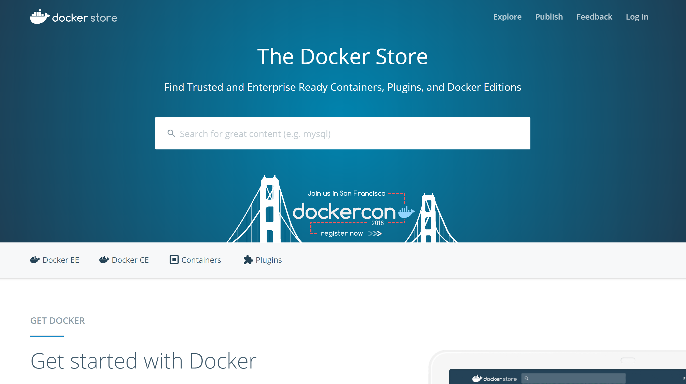

1. In the to pright corner, click `Log In`. On the Log In screen, select `Create Account` and complete the new account process.

1. Verify your email address by clicking the verification link in the email sent by Docker Store. 

1. Login into the Docker Store, navigate to [Docker Enterprise Edition Trial](https://store.docker.com/editions/enterprise/docker-ee-trial), and select `Start 1 Month Trial`. 

	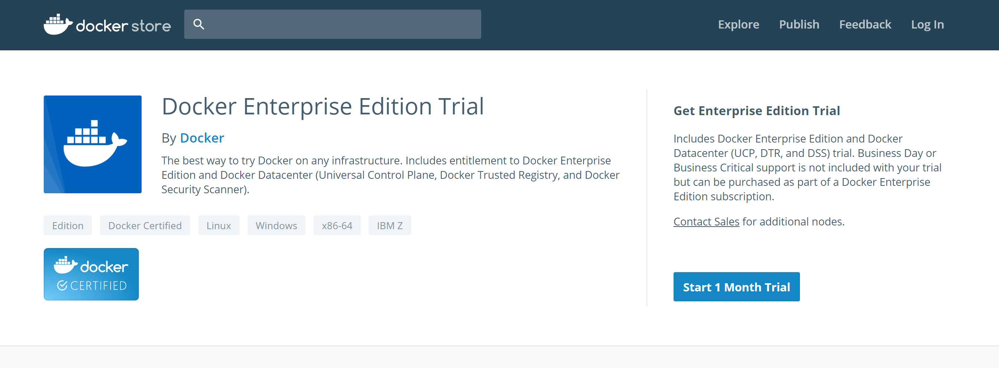

1. Complete the form and click `Start your evaluation`. You will be taken to the Setup Instructions screen. 

	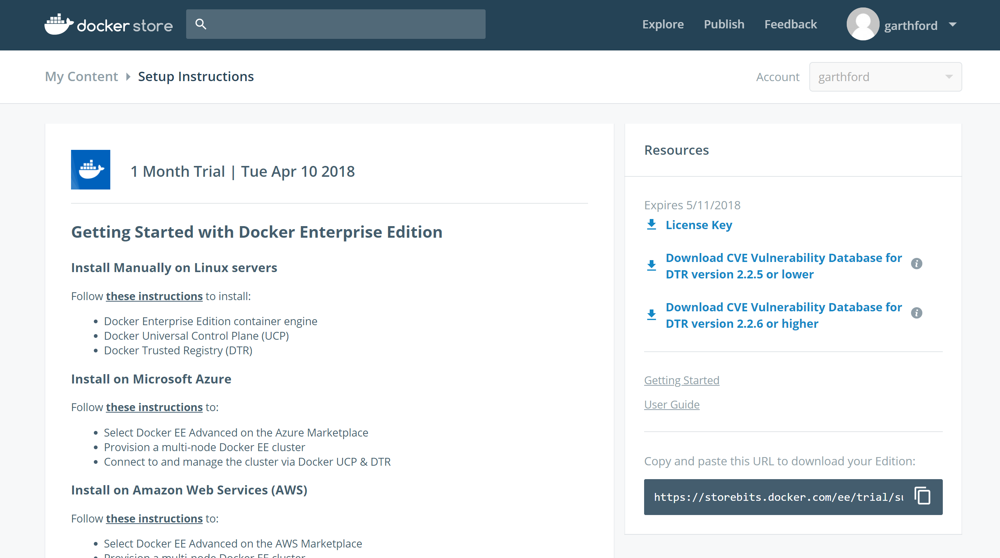

	Note that URL at the bottom of the `Resources` column; it is labeled "Copy and pase this URL to download your Edition" and is structured as `https://storebits.docker.com/ee/trial/sub-00000000-0000-0000-0000-000000000000`. This URL is your specific Docker EE Trial License Key and will be used when we provision Azure resources.

	Also under the `Resources` section, click `License Key` to download a `docker_subscription.lic` file. This file is uploaded to a running Docker EE cluster to configure licensing requirements.

### <a name="task 0.2"></a>Task 0.2: Deploy Docker EE cluster to Azure

An Azure Resource Manager (ARM) Template is provided for this lab. The template provisions all necessary cloud infrastructure to a new Azure Resource Group. 

1. Right-click the following blue `Deploy to Azure` button and open the hyperlink in a new browser tab or window:

	<a href="https://portal.azure.com/#create/Microsoft.Template/uri/https%3A%2F%2Fraw.githubusercontent.com%2Fstevenfollis%2Fhybrid-workshop%2Fmaster%2Farm_template%2Fazuredeploy.json" rel="nofollow">
			
	</a>

1. The Azure Portal will open in the new tab. Sign in, and on the Custom Deployment configure the template deployment:

	* Select the subscription that you would like to use for this lab from the dropdown box
	
	* Create a new Resource Group, named in a way that is globally unique (we use this name as part of URLs). Your initials or a few random numbers should be sufficient. ex. `gf-docker-lab`, `docker-ee-421`, or `lab413`. If you and a colleague(s) are completing this lab at the same time, ensure that you are not using duplicative names.
	
	* In the `DockerEEURL` box, paste in the URL that you copied down from the Docker Store in the previous activity. This is the URL that looks like `https://storebits.docker.com/ee/trial/sub-00000000-0000-0000-0000-000000000000` and is used to automatically setup the cluster with your 30-Day Trial License.

	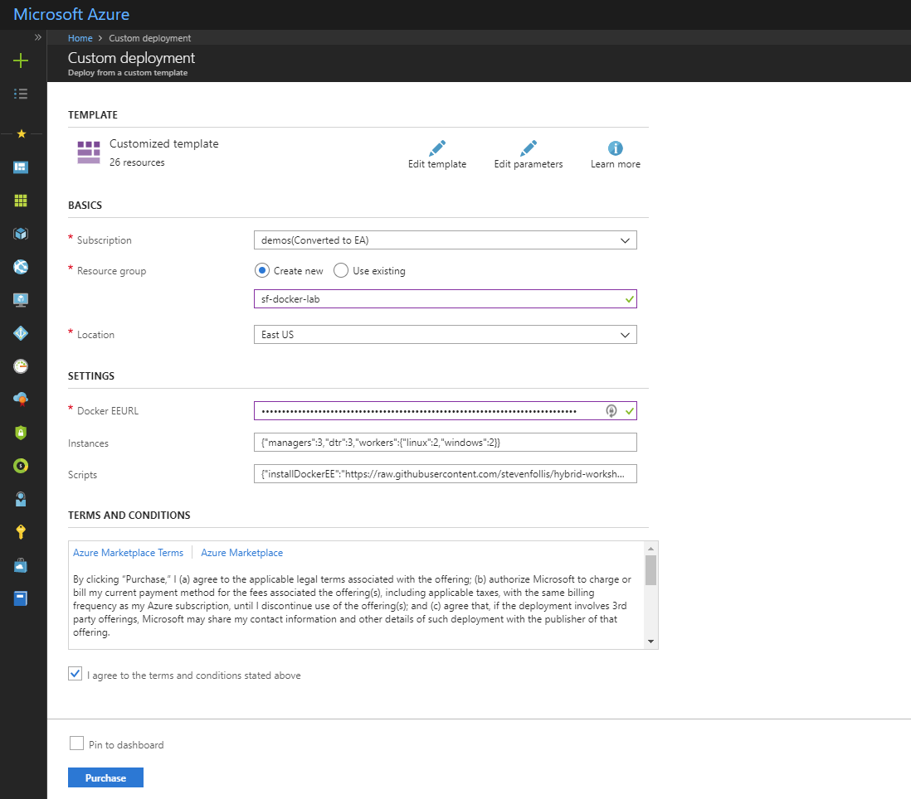

1. With the form completed, check the box for `I agree to the terms and conditions stated above` and click the `Purchase` button to begin the provisioning process.

The provisioning process often takes 15-20 minutes to fully create and setup the entire Docker EE Cluster. In the interim, please feel free to take a short break, or begin watching the YouTube Video entitled [Getting Started with Docker for Windows and .NET Apps](https://www.youtube.com/watch?v=Pitm1x7pTfI).

1. When the template deployment is completed, navigate to your Azure Resource Group and on the left-hand side select `Deployments`. 
	
	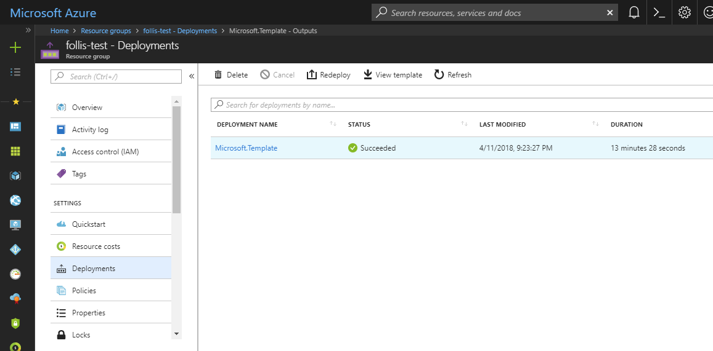

1. Select the single deployment named `Microsoft.Template`, and on the following blade select `Outputs`. Make note of the `UCP_URL` and `DTR_URL`, as we will use these hyperlinks in future steps.

	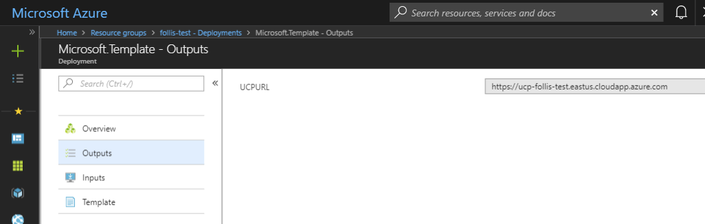

	> **NOTE**: Keep this Azure Portal bale open in a separate browser tab for easy reference

The ARM Template deploys a variety of Azure resources, depicted by the follow architecture:

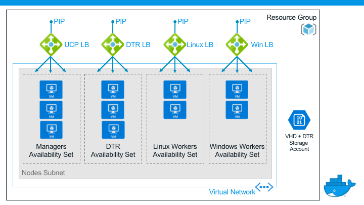

### <a name="task 0.3"></a>Task 0.3: Connect to Azure Virtual Machines

One of the key benefits of Docker EE is the ability to manage both Linux-based and Windows-based applications side-by-side on a single cluster. In the lab will be accessing using both types of Azure Virtual Machines, so let us test connectivity. 

1. In the Azure Resource Group blade where the resources were provisioned, select the Virtual Machine named `worker-win-02`. From the VM's blade, click `Connect` to download a Windows Remote Desktop Connection File (.rdp).  

	> **Note** When navigating within an Azure Portal Resource Group blade that container numerous resources, toggle the `No grouping` dropdown on the top-right control bar to `Group by type`. It will be infinitely easier to locate particular resources.

	On your local machine, open the .rdp file and login using username `\eeadmin` and password `DockerEE123!`. Open a PowerShell window inside of the RDP connection and run `docker version` to ensure that the Docker Engine was properly installed.

	> **Note** Remote Desktop is also available for Mac Users via the [Apple Store](https://itunes.apple.com/us/app/microsoft-remote-desktop-8-0/id715768417?mt=12)

1. Back in the Azure Resource Group blade, select the virtual machine named `worker-linux-02`. From the VM's blade, click `Connect` to see the command for starting an SSH connection to the node. Example `ssh eeadmin@13.92.152.49`

	On your local machine, SSH into the VM. If you are running Windows 10 Fall Creator's Update or later you have SSH built into PowerShell and can run the `ssh` command directly in PowerShell. Otherwise, [putty](https://www.howtogeek.com/311287/how-to-connect-to-an-ssh-server-from-windows-macos-or-linux/) or the Windows Subsystem for Linux (WSL) can be used. 

	Once you establish an SSH connection to the remote VM, run `docker version` to ensure that the DOcker Engine was properly installed.

You have now accessed each type of VM used in today's lab.

## <a name="task1"></a>Task 1: Configure the Docker EE Cluster

The Azure environment is almost completely set up, but before we can begin the labs, we need to do two more steps. First we will add an additional Windows node to the cluster. We have left the node unjoined so you can see how easy it is to do. Then, will create two repositories in Docker Trusted Registry.
(The Linux worker nodes are already added to the cluster)

### <a name="task 1.1"></a>Task 1.1: Accessing UCP

The "Universal Control Plane" is a web-based interface for administering our container workloads across an entire cluster of virtual machine nodes. Next, we will use UCP to finalize our cluster configuration.

1. Navigate in your web browser to the UCP URL that you previously located in the Azure Portal. ex. `https://ucp-gf-docker-lab52.eastus.cloudapp.azure.com`

	> **Note**: Because this is a lab-based install of Docker EE we are using the default self-signed certificates. Because of this your browser may display a security warning. It is safe to click through this warning.
	>
	> In a production environment you would use certificates from a trusted certificate authority and would not see this screen.
	> 

1. When prompted enter the username `admin` and password `DockerEE123!`. The UCP web interface should load up in your web browser.

### <a name="task1.2"></a>Task 1.2: Join a Windows worker node

Let's start by adding our 2nd Windows Server 2016 worker node to the cluster.

1. You will be asked for a license key. Click `Upload License` and select the `docker_subscription.lic` file that was downloaded from the Docker Store after signing up for the Trial License.

1. From the main dashboard in UCP, click `Add a Node` on the bottom left of the screen

	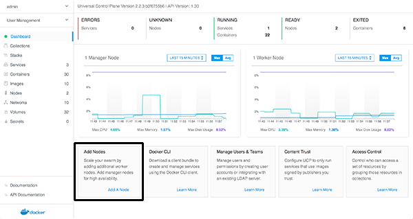

1. Select node type "Windows", check the box, that you followed the instructions and copy the text from the dark box shown on the `Add Node` screen.

	> **Note** There is an icon in the upper right corner of the box that you can click to copy the text to your clipboard
	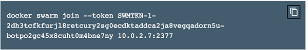

	> **Note**: You may notice that there is a UI component to select `Linux` or `Windows`on the `Add Node` screen. In a production environment where you are starting from scratch there are [a few prerequisite steps] to adding a Windows node. However, we've already done these steps in the PWD environment. So for this lab, just leave the selection on `Linux` and move on to step 2


1. We need to run the `docker swarm join` command inside of a Window Server node to add it to the cluster. Open the Remote Desktop Connection to your `worker-win-02` Windows Server VM from earlier.

1. Paste the `docker swarm join` text from UCP into a command prompt or PowerShell window in the remote desktop connection.

	You should see the message `This node joined a swarm as a worker.` indicating you've successfully joined the node to the cluster.

1. Switch back to the UCP server in your web browser and click the `x` in the upper right corner to close the `Add Node` window

1. You should be taken to the `Nodes` screen and will see 3 nodes listed at the bottom of your screen.

	Initially the new worker node will be shown with status `down`. After a minute or two, refresh your web browser to ensure that your Windows worker node has come up as `healthy`

	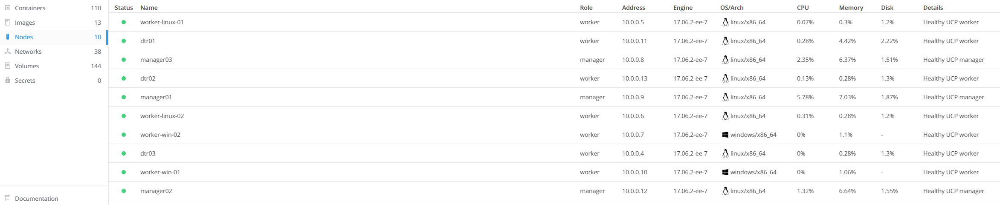

Congratulations on adding a Windows node to your UCP cluster. Next, we will create several repositories in Docker Trusted Registry.

### <a name="task1.3"></a>Task 1.3: Create Three DTR Repositories

Docker Trusted Registry is a special server designed to store and manage your Docker images. In this lab we're going to create three different Docker images, and push them to DTR. But before we can do that, we need to setup repositories in which those images will reside. Often that would be enough.

However, before we create the repositories, we do want to restrict access to them. Since we have two distinct app components, a Java web app (with a database), and a .NET API, we want to restrict access to them to the team that develops them, as well as the administrators. To do that, we need to create two users and then two organizations.

1. Open DTR from the URL located in the Ouputs section of the Azure Portal's Template Deployment blade that we located earlier, ex. `https://dtr-gf-docker-lab.eastus.cloudapp.azure.com`

	> **Note**: As with UCP before, DTR is also using self-signed certs. It's safe to click through any browser warning you might encounter.

2. From the main DTR page, click users and then the New User button.

	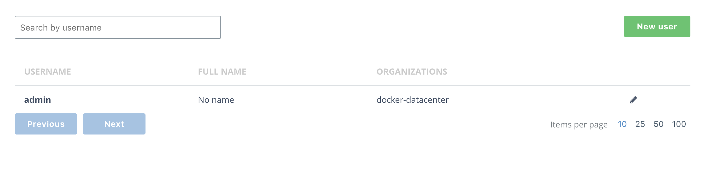

3. Create a new user, `java_user` and give it a password you'll remember. I used `user1234`. Be sure to save the user.

	

	Then do the same for a `dotnet_user`.

4. Select the Organization button.

	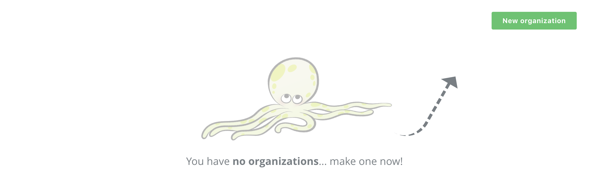

5. Press New organization button, name it java, and click save.

	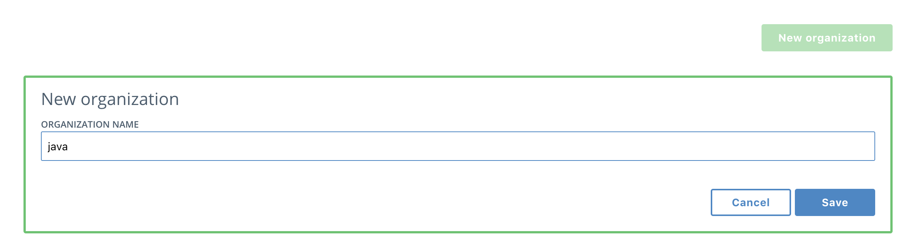

	Then do the same with dotnet and you'll have two organizations.

	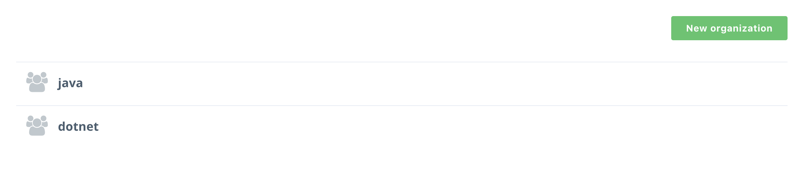

6. Now you get to add a repository! Click on the java organization, select repositories and then Add repository

	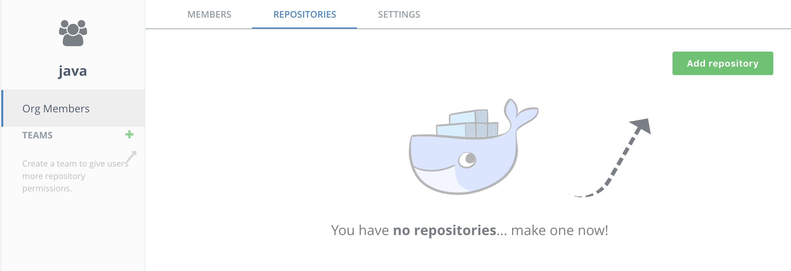

7. Name the repository `java_web`. 

	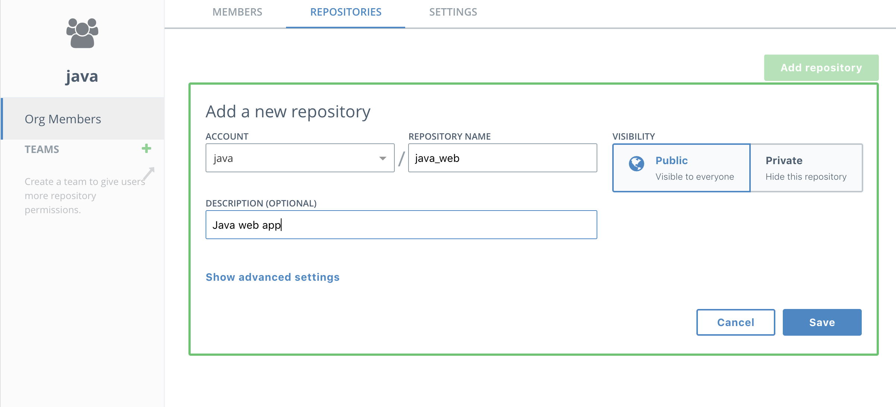

	> Note the repository is listed as "Public" but that means it is publicly viewable by users of DTR. It is not available to the general public.

8. Now it's time to create a team so you can restrict access to who administers the images. Select the `java` organization and the members will show up. Press Add user and start typing in java. Select the `java_user` when it comes up.

	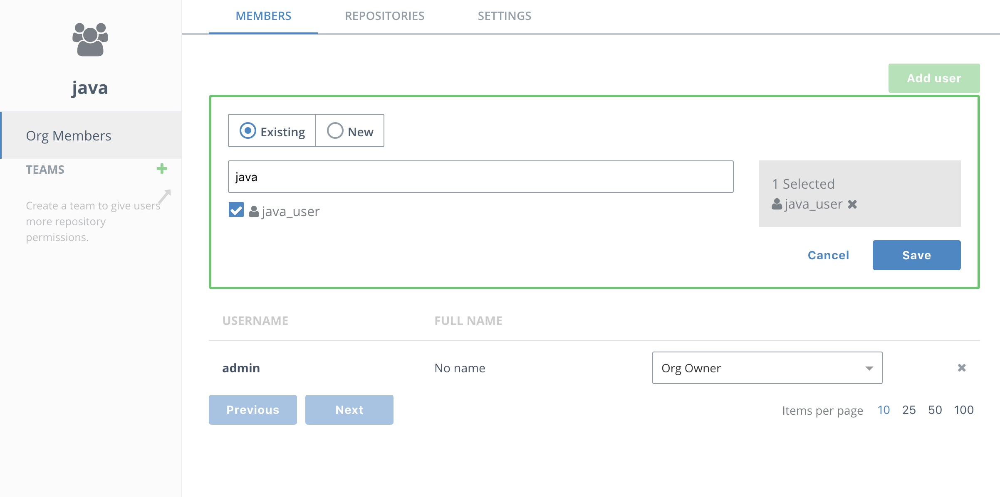

9. Next select the `java` organization and press the `Team` button to create a `web` team.

	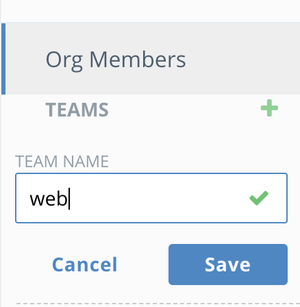

10. Add the `java_user` user to the `web` team and click save.

	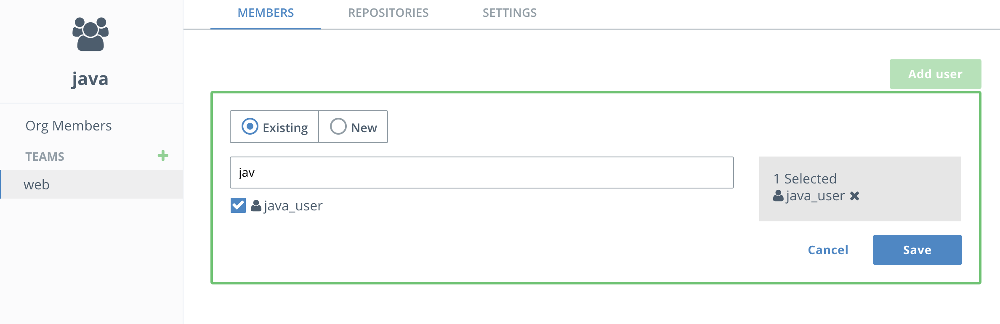

	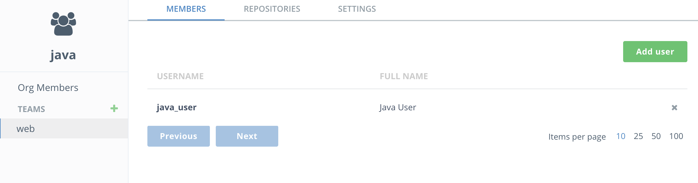

11. Next select the `web` team and select the `Repositories` tab. Select `Add Existing repository` and choose the `java_web` repository. You'll see the `java` account is already selected. Then select `Read/Write` permissions so the `web` team has permissions to push images to this repository. Finally click `Save`.

	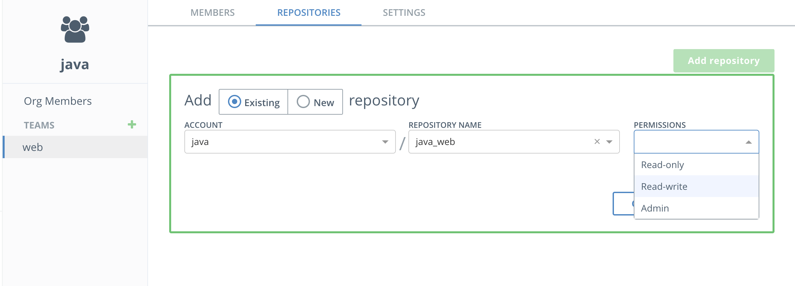

12. Now add a new repository also owned by the web team and call it `database`. This can be done directly from the web team's `Repositories` tab by selecting the radio button for Add `New` Repository. Be sure to grant `Read/Write` permissions for this repository to the `web` team as well.

	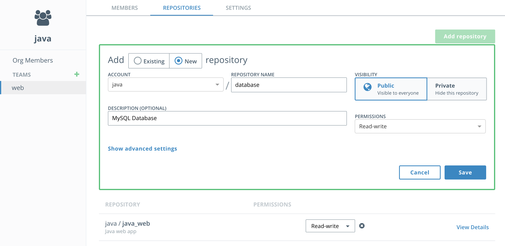

13. Repeat 4-11 above to create a `dotnet` organization with a repository called `dotnet_api`, the `dotnet_user`, and a team named `api` (with `dotnet_user` as a member). Grant `read/write` permissions for the `dotnet_api` repository to the `api` team.

14. From the main DTR page, click Repositories, you will now see all three repositories listed.
	
	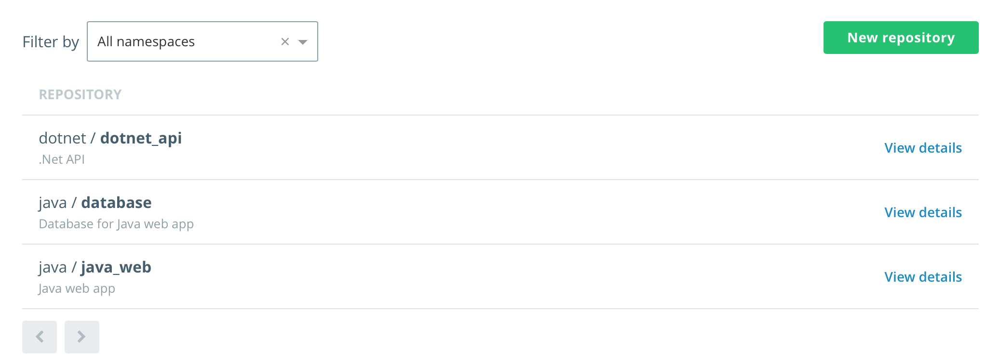

15. (optional) If you want to check out security scanning in Task 5, you should turn on scanning now so DTR downloads the database of security vulnerabilities. In the left-hand panel, select `System` and then the `Security` tab. Select `ENABLE SCANNING` and `Online`.

	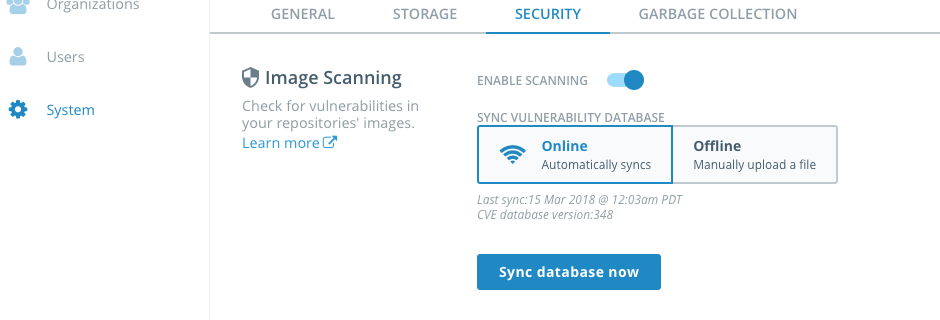

Congratulations, you have created three new repositories in two new organizations, each with one team and a user each.

## <a name="task2"></a>Task 2: Deploy a Java Web App with Universal Control Plane
Now that we've completely configured our cluster, let's deploy a couple of web apps. These are simple web pages that allow you to send a tweet. One is built on Linux using NGINX and the other is build on Windows Server 2016 using IIS.  

Let's start with the Linux version.

### <a name="task2.1"></a> Task 2.1: Clone the Demo Repo


1. In a terminal window, re-establish the earlier SSH connection to the `worker-linux-02` Azure VM that we tested earlier.

1. Before continuing, let us configure an environment variable for the DTR URL/DTR hostname. Navigate to the Azure Portal's template deployment output blade. Select and copy the the URL for the DTR hostname.

1. Set an environment variable `DTR_HOST` using the DTR host name defined on your Play with Docker landing page:

	```bash
	$ export DTR_HOST=<dtr hostname>
	$ echo $DTR_HOST
	```

1. Now use git to clone the workshop repository.

	```bash
	$ git clone https://github.com/dockersamples/hybrid-app.git
	```

	You should see something like this as the output:

	```bash
	Cloning into 'hybrid-app'...
	remote: Counting objects: 389, done.
	remote: Compressing objects: 100% (17/17), done.
	remote: Total 389 (delta 4), reused 16 (delta 1), pack-reused 363
	Receiving objects: 100% (389/389), 13.74 MiB | 3.16 MiB/s, done.
	Resolving deltas: 100% (124/124), done.
	Checking connectivity... done.
	```

	You now have the necessary demo code on your worker host.

### <a name="task2.2"></a> Task 2.2: Build and Push the Linux Web App Images


1. Change into the `java-app` directory.

	```bash
	$ cd ./hybrid-app/java-app/
	```

1. Use `docker build` to build your Docker image.

	```Bash
	$ docker build -t $DTR_HOST/java/java_web .
	```

	The `-t` tags the image with a name. In our case, the name indicates which DTR server and under which organization's respository the image will live.

	> **Note**: Feel free to examine the Dockerfile in this directory if you'd like to see how the image is being built. Run `cat Dockerfile` or open the file in GitHub via a web browser.

	There will be quite a bit of output. The Dockerfile describes a two-stage build. In the first stage, a Maven base image is used to build the Java app. But to run the app you don't need Maven or any of the JDK stuff that comes with it. The second stage takes the output of the first stage and puts it into a much smaller Tomcat image.

1. Log into your DTR server from the command line.
 
	First use the `dotnet_user`, which isn't part of the java organization

	```bash
	$ docker login $DTR_HOST
	Username: <your dotnet_user username>
	Password: <your dotnet_user password>
	Login Succeeded
	```
	
	Use `docker push` to upload your image up to Docker Trusted Registry.
	
	```bash
	$ docker push $DTR_HOST/java/java_web
	```
	
	> TODO: add output of failure to push

	```bash
	$ docker push $DTR_HOST/java/java_web
	The push refers to a repository [.<dtr hostname>/java/java_web]
	8cb6044fd4d7: Preparing
	07344436fe27: Preparing
	...
	e1df5dc88d2c: Waiting
	denied: requested access to the resource is denied
	```

	As you can see, the access control that you established in the [Task 1.3](#task1.3) prevented you from pushing to this repository.	

1. Now try logging in using `java_user`, and then use `docker push` to upload your image up to Docker Trusted Registry.

	```bash
	$ docker push $DTR_HOST/java/java_web
	```

	The output should be similar to the following:

	```bash
	The push refers to a repository [<dtr hostname>/java/java_web]
	feecabd76a78: Pushed
	3c749ee6d1f5: Pushed
	af5bd3938f60: Pushed
	29f11c413898: Pushed
	eb78099fbf7f: Pushed
	latest: digest: sha256:9a376fd268d24007dd35bedc709b688f373f4e07af8b44dba5f1f009a7d70067 size: 1363
	```

	Success! Because you are using a user name that belongs to the right team in the right organization, you can push your image to DTR.

1. In your web browser head back to your DTR server and click `View Details` next to your `java_web` repo to see the details of the repo.

	> **Note**: If you've closed the tab with your DTR server, copy and paste the DTR URL from the Azure Portal output blade into a new web browser tab

1. Click on `Images` from the horizontal menu. Notice that your newly pushed image is now on your DTR.

	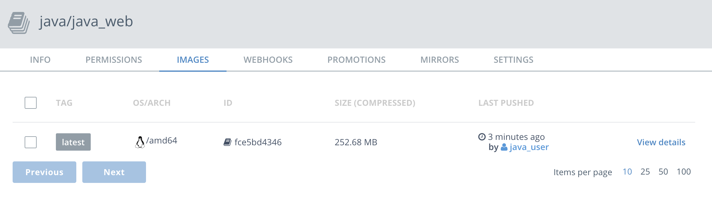

1. Next, build the MySQL database image. In the SSH session, change into the database directory.

	```bash
		$ cd ../database
	```

1. Use `docker build` to build your Docker image.

	```bash
	$ docker build -t $DTR_HOST/java/database .
	```

1. Use `docker push` to upload your image up to Docker Trusted Registry.
	```bash
	$ docker push $DTR_HOST/java/database
	```

1. In your web browser head back to your DTR server and click `View Details` next to your `database` repo to see the details of the repo.

1. Click on `Images` from the horizontal menu. Notice that your newly pushed image is now on your DTR.

### <a name="task2.3"></a> Task 2.3: Deploy the Web App using UCP


The next step is to run the app in Swarm. As a reminder, the application has two components, the web front-end and the database. In order to connect to the database, the application needs a password. If you were just running this in development you could easily pass the password around as a text file or an environment variable. But in production you would never do that. So instead, we're going to create an encrypted secret. That way access can be strictly controlled.

1. Open UCP by copying and pasting the UCP URL hyperlink from the Azure Portal outputs blade. You should see the Universal Control Panel dashboard.

2.  There's a lot here about managing the cluster. You can take a moment to explore around. When you're ready, click on `Swarm` and select `Secrets`.

	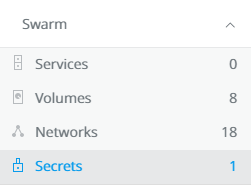

3. You'll see a `Create Secret` screen. Type `mysql_password` in `Name` and `Dockercon!!!` in `Content`. Then click `Create` in the lower left. Obviously you wouldn't use this password in a real production environment. You'll see the content box allows for quite a bit of content, you can actually create structured content here that will be encrypted with the secret.

	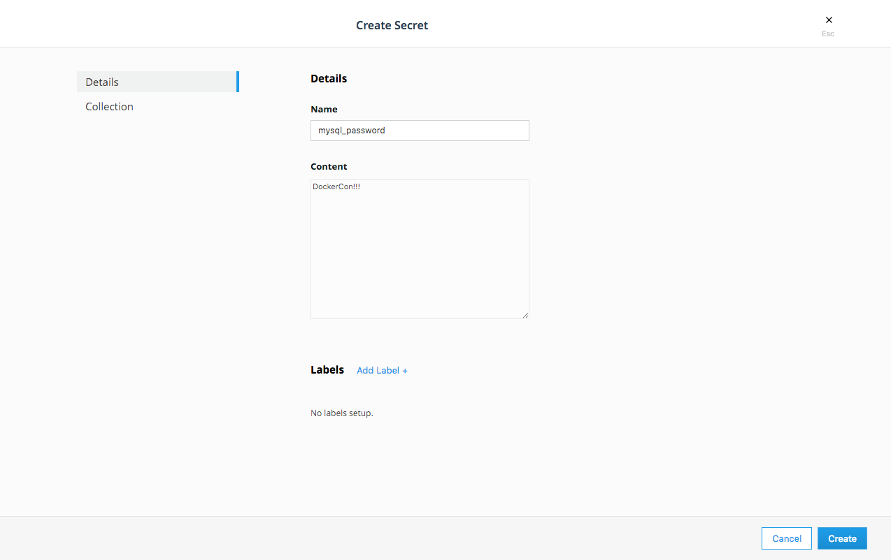

4. Next we're going to create two networks. First click on `Networks` under `Swarm` in the left panel, and select `Create Network` in the upper right. You'll see a `Create Network` screen. Name your first network `back-tier`. Leave everything else the default.

	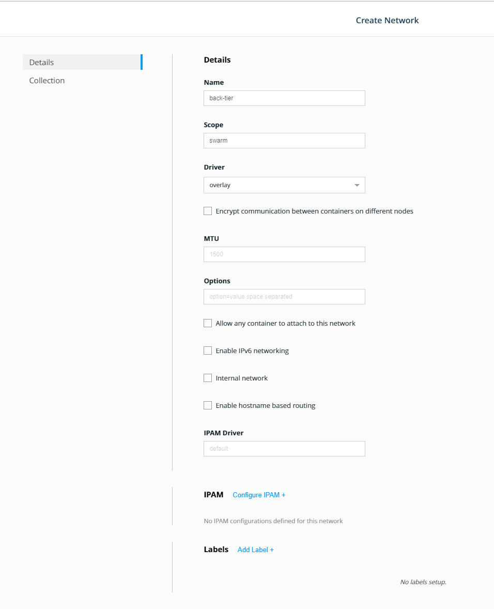

5. Repeat step 4 but with a new network `front-tier`.

6. Now we're going to use the fast way to create your application: `Stacks`. In the left panel, click `Shared Resources`, `Stacks` and then `Create Stack` in the upper right corner.

7. Name your stack `java_web` and select `Swarm Services` for your `Mode`. Below you'll see we've included a `.yml` file. Before you paste that in to the `Compose.yml` edit box, note that you'll need to make a quick change. Each of the images is defined as `<dtr hostname>/java/<something>`. You'll need to change the `<dtr hostname>` to the DTR Hostname found on the Azure Portal outputs blade for your environment. It will look something like this:
`dtr-gf-docker-lab52.eastus.cloudapp.azure.com/java/database`
You can do that right in the edit box in `UCP` but wanted to make sure you saw that first.

	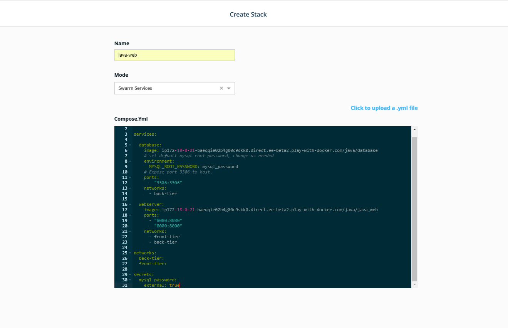

	Here's the `Compose` file. Once you've copy and pasted it in, and made the changes, click `Create` in the lower right corner.

    ```yaml
    version: "3.3"

    services:

      database:
        image: <dtr hostname>/java/database
        # set default mysql root password, change as needed
        environment:
          MYSQL_ROOT_PASSWORD: mysql_password
        # Expose port 3306 to host. 
        ports:
          - "3306:3306" 
        networks:
          - back-tier

      webserver:
        image: <dtr hostname>/java/java_web
        ports:
          - "8080:8080" 
        networks:
          - front-tier
          - back-tier

    networks:
      back-tier:
      front-tier:
        external: true 

    secrets:
      mysql_password:
        external: true
    ```

	Then click `Done` in the lower right.

8. Click on `Stacks` again, and select the `java_web` stack. Click on `Inspect Resources` and then select `Services`. Select `java_web_webserver`. In the right panel, you'll see `Published Endpoints`. Select the one with `:8080` at the end. You'll see a `Apache Tomcat/7.0.84` landing page. Add `/java-web` to the end of the URL and you'll see the app.

	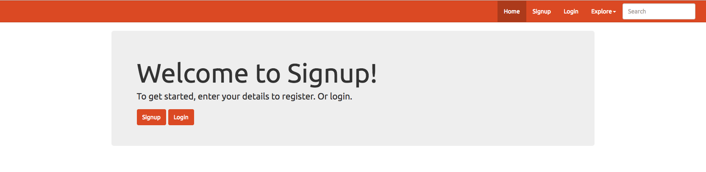

9. Delete the `java_web` stack.

## <a name="task3"></a>Task 3: Deploy the next version with a Windows node

Now that we've moved the app and updated it, we're going to add in a user sign-in API. For fun, and to show off the cross-platform capabilities of Docker EE, we are going to do it in a Windows container with a .NET Framework application.

### <a name="task3.1"></a> Task 3.1: Clone the repository


1. Because this is a Windows container, we have to build it on a Windows host. Open the Remote Desktop Connection to `worker-win-02` from earlier. 

1. Open PowerShell, change directory to `C:\` and clone the repository again onto this host:

	```powershell
	PS C:\User\eeadmin> cd c:\

	PS C:\> git clone https://github.com/dockersamples/hybrid-app.git
	```

1. Set an environment variable for the DTR host name. Much like you did for the Java app, this will make a few step easier. Copy the DTR host name again and create the environment variable. For instance, if your DTR host was `dtr-gf-docker-lab52.eastus.cloudapp.azure.com` you would type:

	```powershell
	PS C:\> $env:DTR_HOST="dtr-gf-docker-lab52.eastus.cloudapp.azure.com"
	```

### <a name="task3.2"></a> Task 3.2: Build and Push Windows Images to Docker Trusted Registry


1. CD into the `c:\hybrid-app\netfx-api` directory. 

	> Note you'll see a `dotnet-api` directory as well. Do not use that directory. That's a .NET Core api that runs on Linux. We'll use that later in the Kubernetes section.

	```powershell
	PS C:\> cd c:\hybrid-app\netfx-api\
	```

1. Use `docker build` to build your Windows image.

	```powershell
	PS C:\hybrid-app\netfx-api> docker build -t $env:DTR_HOST/dotnet/dotnet_api .
	```

	> **Note**: Feel free to examine the Dockerfile in this directory if you'd like to see how the image is being built.

	Your output should be similar to what is shown below

	```powershell
	PS C:\hybrid-app\netfx-api> docker build -t $env:DTR_HOST/dotnet/dotnet_api .

	Sending build context to Docker daemon  415.7kB
	Step 1/8 : FROM microsoft/iis:windowsservercore-10.0.14393.1715
	 ---> 590c0c2590e4

	<output snipped>

	Removing intermediate container ab4dfee81c7e
	Successfully built d74eead7f408
	Successfully tagged <dtr hostname>/dotnet/dotnet_api:latest
	```

	> **Note**: It will take a few minutes for your image to build.

4. Log into Docker Trusted Registry

	```powershell
	PS C:\hybrid-app\netfx-api> docker login $env:DTR_HOST
	Username: dotnet_user
	Password: user1234
	Login Succeeded
	```

5. Push your new image up to Docker Trusted Registry.

	```powershell
	PS C:\hybrid-app\netfx-api> docker push $env:DTR_HOST/dotnet/dotnet_api
	The push refers to a repository [<dtr hostname>/dotnet/dotnet_api]
	5d08bc106d91: Pushed
	74b0331584ac: Pushed
	e95704c2f7ac: Pushed
	669bd07a2ae7: Pushed
	d9e5b60d8a47: Pushed
	8981bfcdaa9c: Pushed
	25bdce4d7407: Pushed
	df83d4285da0: Pushed
	853ea7cd76fb: Pushed
	55cc5c7b4783: Skipped foreign layer
	f358be10862c: Skipped foreign layer
	latest: digest: sha256:e28b556b138e3d407d75122611710d5f53f3df2d2ad4a134dcf7782eb381fa3f size: 2825
	```

6. You may check your repositories in the DTR web interface to see the newly pushed image.

### <a name="task3.3"></a> Task 3.3: Deploy the Java web app


1. First we need to update the Java web app so it'll take advantage of the .NET API. Switch back to `worker-linux-02` and change directories to the `java-app-v2` directory. Repeat steps 1,2, and 4 from Task 2.2 but add a tag `:2` to your build and pushes:

	```bash
	$ docker build -t $DTR_HOST/java/java_web:2 .
	$ docker push $DTR_HOST/java/java_web:2
	```

	This will push a different version of the app, version 2, to the same `java_web` repository.

2. Next repeat the steps 6-8 from Task 2.3, but use this `Compose` file instead:

	```yaml
    version: "3.3"

    services:

      database:
        image: <dtr hostname>/java/database
        # set default mysql root password, change as needed
        environment:
          MYSQL_ROOT_PASSWORD: mysql_password
        # Expose port 3306 to host. 
        ports:
          - "3306:3306" 
        networks:
          - back-tier

      webserver:
        image: <dtr hostname>/java/java_web:2
        ports:
          - "8080:8080" 
        networks:
          - front-tier
          - back-tier
        environment:
          BASEURI: http://dotnet-api/api/users

      dotnet-api:
        image: <dtr hostname>/dotnet/dotnet_api
        ports:
          - "57989:80"
        networks:
          - front-tier
          - back-tier

    networks:
      back-tier:
	  front-tier:
	    external: true

    secrets:
      mysql_password:
        external: true
	```

3. Once tested, delete the stack.

## <a name="task4"></a>Task 4: Deploy to Kubernetes

Now that we have built, deployed and scaled a multi OS application to Docker EE using Swarm mode for orchestration, let's learn how to use Docker EE with Kubernetes.

Docker EE lets you choose the orchestrator to use to deploy and manage your application, between Swarm and Kubernetes. In the previous tasks we have used Swarm for orchestration. In this section we will deploy the application to Kubernetes and see how Docker EE exposes Kubernetes concepts.

### <a name="task4.1"></a>Task 4.1: Build .NET Core app instead of .NET


For now Kubernetes does not support Windows workloads in production, so we will start by porting the .NET part of our application to a Linux container using .NET Core.

1. In your SSH connection to `worker-linux-02`, CD into the `hybrid-app/dotnet-api` directory. 

	```bash
	$ cd ~/hybrid-app/dotnet-api/
	```

2. Use `docker build` to build your Linux image.

	```bash
	$ docker build -t $DTR_HOST/dotnet/dotnet_api:core .
	```

	> **Note**: Feel free to examine the Dockerfile in this directory if you'd like to see how the image is being built. Also, we used the `:core` tag so that the repository has two versions, the original with a Windows base image, and this one with a Linux .NET Core base image.

	Your output should be similar to what is shown below

	```bash
	Sending build context to Docker daemon   29.7kB
	Step 1/10 : FROM microsoft/aspnetcore-build:2.0.3-2.1.2 AS builder
	2.0.3-2.1.2: Pulling from microsoft/aspnetcore-build
	723254a2c089: Pull complete

		<output snipped>

	Removing intermediate container 508751aacb5c
	Step 7/10 : FROM microsoft/aspnetcore:2.0.3-stretch
	2.0.3-stretch: Pulling from microsoft/aspnetcore

	Successfully built fcbc49ef89bf
	Successfully tagged ip172-18-0-8-baju0rgm5emg0096odmg.direct.ee-beta2.play-with-docker.com/dotnet/dotnet_api:latest
	```

	> **Note**: It will take a few minutes for your image to build.

4. Log into Docker Trusted Registry

	```bash
	$ docker login $DTR_HOST
	Username: dotnet_user
	Password: user1234
	Login Succeeded
	```

5. Push your new image up to Docker Trusted Registry.

	```bash
	$ docker push $DTR_HOST/dotnet/dotnet_api:core
	The push refers to a repository [<dtr hostname>/dotnet/dotnet_api]
	5d08bc106d91: Pushed
	74b0331584ac: Pushed
	e95704c2f7ac: Pushed
	669bd07a2ae7: Pushed
	d9e5b60d8a47: Pushed
	8981bfcdaa9c: Pushed
	25bdce4d7407: Pushed
	df83d4285da0: Pushed
	853ea7cd76fb: Pushed
	55cc5c7b4783: Skipped foreign layer
	f358be10862c: Skipped foreign layer
	latest: digest: sha256:e28b556b138e3d407d75122611710d5f53f3df2d2ad4a134dcf7782eb381fa3f size: 2825
	```

6. You may check your repositories in the DTR web interface to see the newly pushed image.

### <a name="task4.2"></a>Task 4.2: Examine the Docker Compose File


Docker EE lets you deploy native Kubernetes applications using Kubernetes deployment descriptors, by pasting the yaml files in the UI, or using the `kubectl` CLI tool.

However many developers use `docker-compose` to build and test their application, and having to create Kubernetes deployment descriptors as well as maintaining them in sync with the Docker Compose file is tedious and error prone.

In order to make life easier for developers and operations, Docker EE lets you deploy an application defined with a Docker Compose file as a Kubernetes workloads. Internally Docker EE uses the official Kubernetes extension mechanism by defining a [Custom Resource Definition](https://kubernetes.io/docs/tasks/access-kubernetes-api/extend-api-custom-resource-definitions/) (CRD) defining a stack object. When you post a Docker Compose stack definition to Kubernetes in Docker EE, the CRD controller takes the stack definition and translates it to Kubernetes native resources like pods, controllers and services.

We'll use a Docker Compose file to instantiate our application, and it's the same file as before, except that we will switch the .NET Docker Windows image with the .NET Core Docker Linux image we just built.

Let's look at the Docker Compose file in `app/docker-stack.yml`.

Change the images for the dotnet-api and java-app services for the ones we just built. And remember to change `<dtr hostname>` to the long DTR hostname listed on the Azure Portal template deployment output blade for your environment.

```yaml
version: '3.3'

services:
  database:
    deploy:
      placement:
        constraints:
        - node.platform.os == linux
    image: <dtr hostname>/java/database
    environment:
      MYSQL_ROOT_PASSWORD: mysql_password
    networks:
      back-tier:
    ports:
    - published: 3306
      target: 3306

  dotnet-api:
    deploy:
      placement:
        constraints:
        - node.platform.os == linux
    image: <dtr hostname>/dotnet/dotnet_api:core
    networks:
      back-tier:
    ports:
    - published: 57989
      target: 80

  java-web:
    deploy:
      placement:
        constraints:
        - node.platform.os == linux
    image: <dtr hostname>/java/java_web:2
    environment:
      BASEURI: http://dotnet-api/api/users
    networks:
      back-tier:
      front-tier:
    ports:
    - published: 8080
      target: 8080

networks:
  back-tier:
  front-tier:
    external: true

secrets:
  mysql_password:
    external: true
```

### <a name="task4.3"></a>Task 4.3: Deploy to Kubernetes using the Docker Compose file


Login to UCP, go to Shared resources, Stacks.

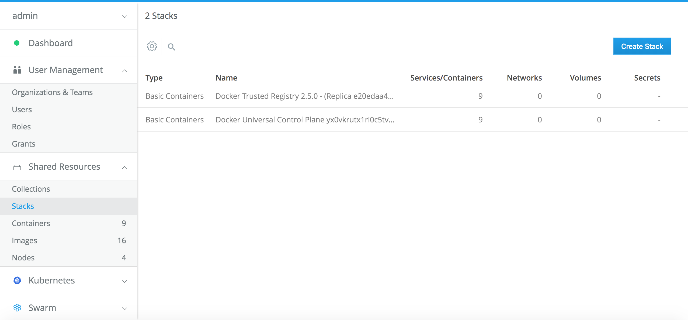

Click create Stack. Fill name: hybrid-app, mode: Kubernetes Workloads, namespace: default.

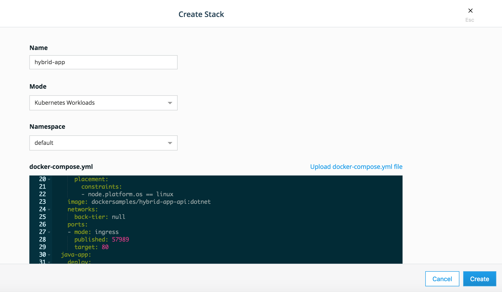

You should see the stack being created.

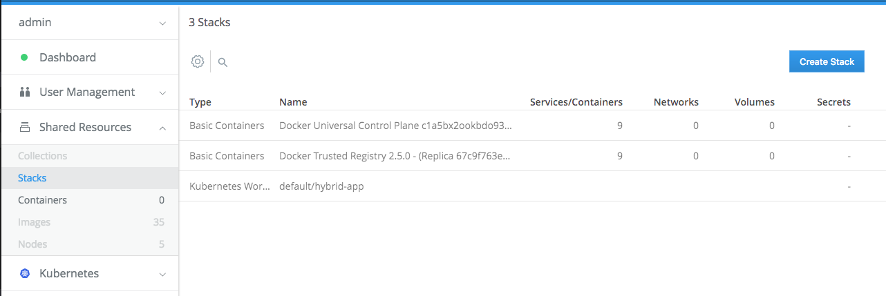

Click on it to see the details.

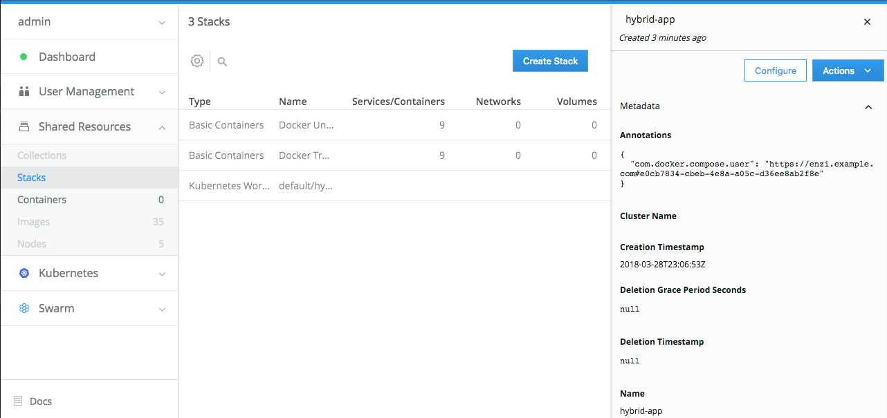

### <a name="task4.4"></a>Task 4.4: Verify the app


Go to Kubernetes / Pod. See the pods being deployed.

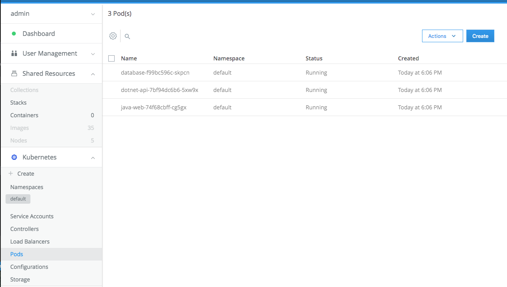

Go to Kubernetes / Controllers. See the deployments and ReplicaSets.

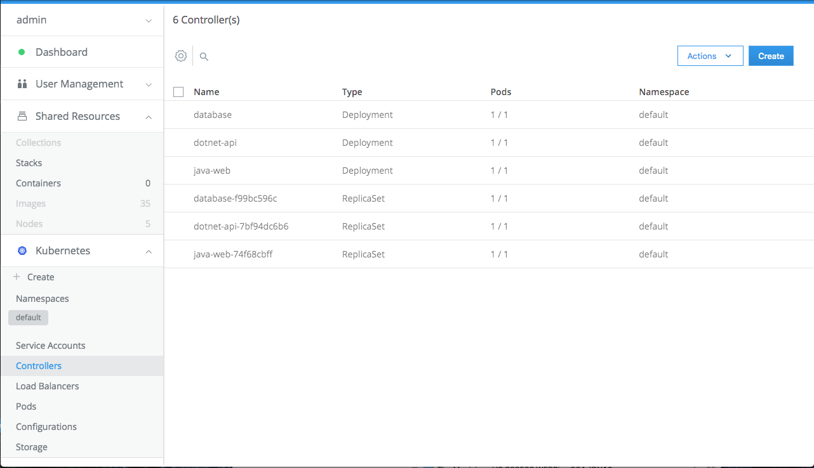

Go to Kubernetes / Load Balancers. See the Kubernetes services that have been created.

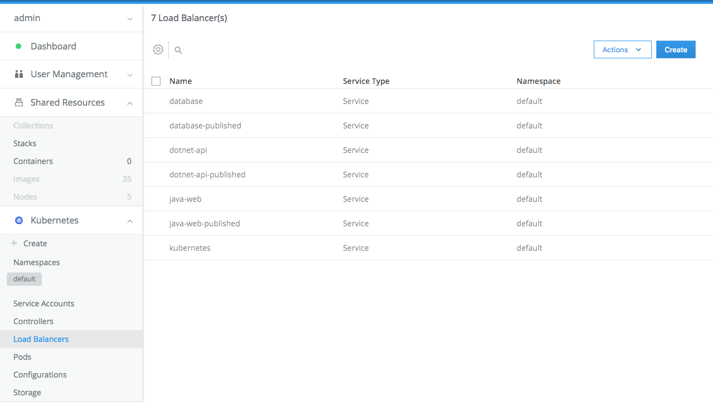

Click on `java-web-published` to the the details of the public load balancer created for the Java application.

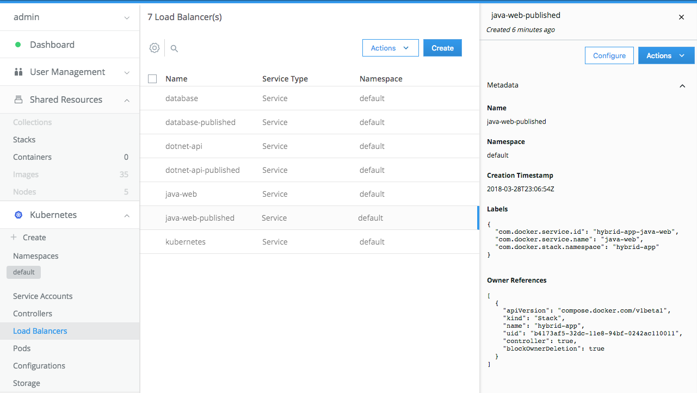

There will be a link for the public url where the service on port 8080 is exposed. Click on that link, add `/java-web/` at the end of the url. You should be led to the running application.

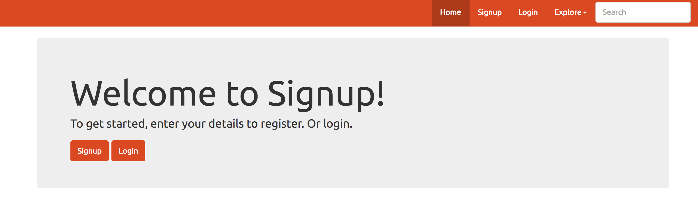

## <a name="task5"></a>Task 5: Security Scanning

Security is crucial for all organizations. And it is a complicated topic, too indepth to go through in detail here. We're going to look at just one of the features that Docker EE has to help you build a secure software supply chain: Security Scanning.

1. If you turned on security in Task 1.3 step 14 you can skip this step. Otherwise, turn on scanning now so DTR downloads the database of security vulnerabilities. In the left-hand panel, select `System` and then the `Security` tab. Select `ENABLE SCANNING` and `Online`.

	

	This will take awhile so you may want to take a break by reading up on [Docker Security](https://www.docker.com/docker-security).

2. Once the scanning database has downloaded, you can scan individual images. Select a repository, such as `java/java_web`, and then select the `Images` tab. If it hasn't already scanned, select `Start scan`. If it hasn't scanned already, this can take 5-10 minutes or so.

	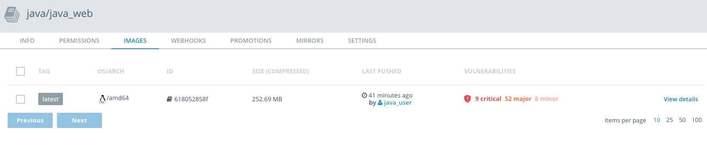

	You see that in fact there are alot of vulnerabilities! That's because we deliberately chose an old version of the `tomcat` base image. Also, most operating systems and many libraries contain some vulnerabilities. The details of these vulnerabilites and when they come into play are important. You can select `View details` to get more information. You can see which layers of your image introduced vulnerabilities.

 	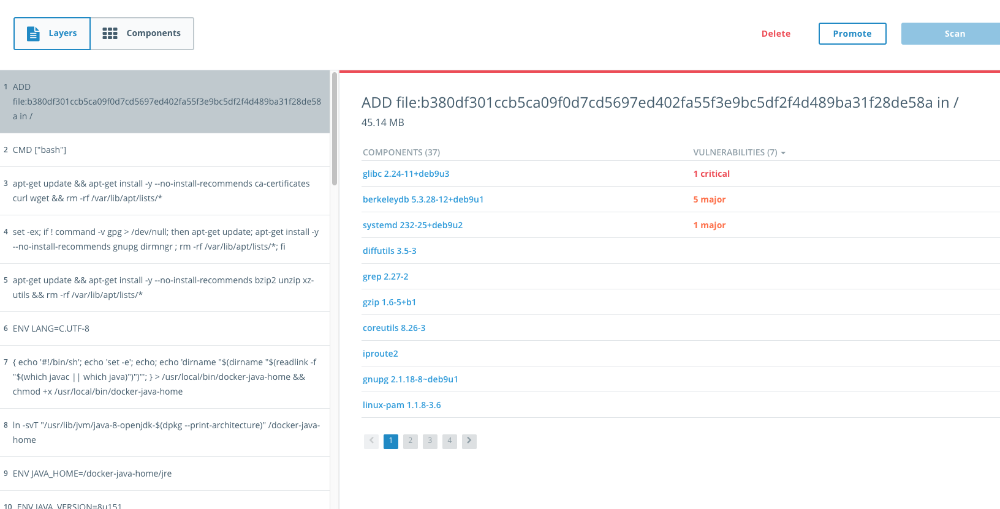

	And by selecting `Components` you can see what the vulnerabilities are and what components introduced the vulnerabilies. You can also select the vulnerabilies and examine them in the [Common Vulnerabilies and Exploits database](https://cve.mitre.org/).

 	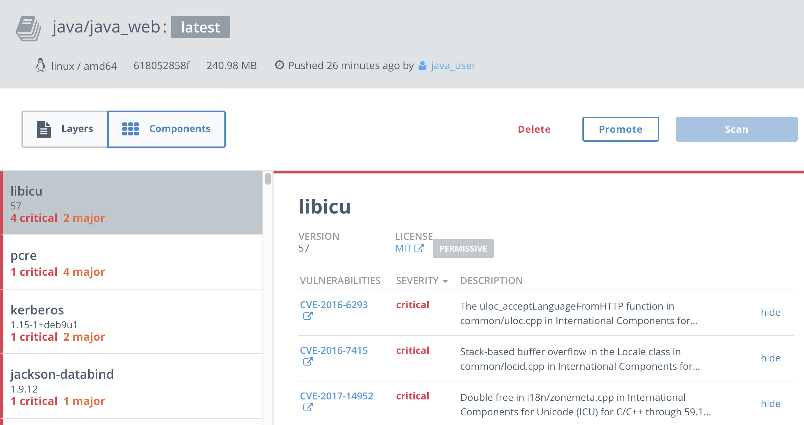

 3. One way you can reduce your vulnerabilities is to choose newer images. For instance, you can go back to the Dockerfile in the `~/hybrid-app/java-app` directory, and change the second base image to `tomcat:9.0.6-jre-9-slim`. Slim images in official images are generally based on lighter-weight operating systems like `Alpine Linux` or `Debian`, which have reduced attack space. You can change the Dockerfile using `vim` or `emacs`.

	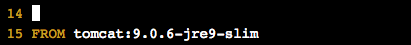

	Then check the scanning again (this may again take 5-10 minutes).

	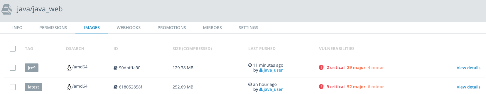

	You'll still see vulnerabilites, but far fewer.

4. If you look at the components of the `tomcat:9.0.6-jre-9-slim` image, you will see that the critical and major vulnerabilities were brought in the `Spring` libraries. So maybe it's time to upgrade our app! 

	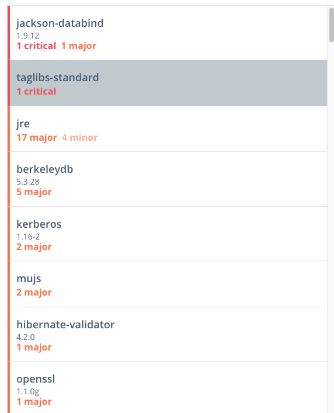

	Upgrading the app is out of scope for this workshop, but you can see how it would give you the information you need to mitigate vulnerabilities.

5. DTR also allows you to [Sign Images](https://docs.docker.com/datacenter/dtr/2.4/guides/user/manage-images/sign-images/) and [Create promotion policies](https://docs.docker.com/datacenter/dtr/2.4/guides/user/create-promotion-policies/) which prevent users from using images in production that don't meet whatever criteria you set, including blocking images with critical and/or major vulnerabilities.

## Common Issues

* Confirm that you are setting the environmental variable DTR_HOST to the DTR hostname.

* When deploying the ARM Template, set the Azure Resource Group name with random characters to ensure it is globally unique. This RG name is used to build DNS entries, and if it conflicts with an existing resource in Azure with the same name there will be errors.. 
	
	Good: `docker-ee-gf`, `ee-lab142`, `docker0412`. 
	
	Bad: `docker`, `docker-ee`, `docker-lab`. 

* The Azure Load Balancer requires a given port to be explicitly opened via a routing rule and probe. Ports `80`, `443` and `8080` are pre-opened for the lab, but if you publish a container with a port outside of this it will not be resolveable until also updating the Load Balancer. Example: publishing a service to port `30001` would require an additional LB routing rule and probe.

* The hostname routing feature of Docker EE's Interlock 2.0 system typically allow you to use a DNS name rather than a port number to load applications. However, this requires additonal setup not done for the lab - setting up a DNS Wildcard entry pointing at the apps load balancer.

* This lab provisions a highly-available cluster of 10 virtual machine nodes. Azure Subscriptions container a quota of number of VM cores; if you hit an error during template deployment related to cores quota please remove VMs from other resource groups. This lab has not been tested on other sized Docker EE clusters.

## Conclusion

In this lab we've looked how Docker EE and Microsoft Azure can help you manage both Linux and Windows workloads whether they be traditional apps you've modernized or newer cloud-native apps, leveraging Swarm or Kubernetes for orchestration.

You can find more information on Docker EE at [http://www.docker.com](http://www.docker.com/enterprise-edition) as well as continue exploring using our hosted trial at [https://dockertrial.com](https://dockertrial.com)
