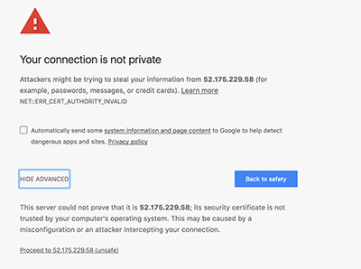
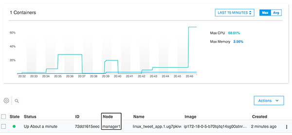
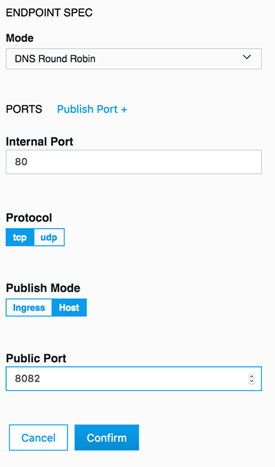
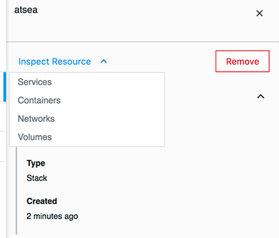
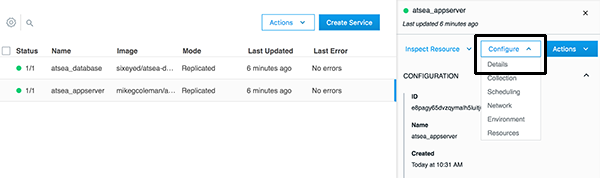
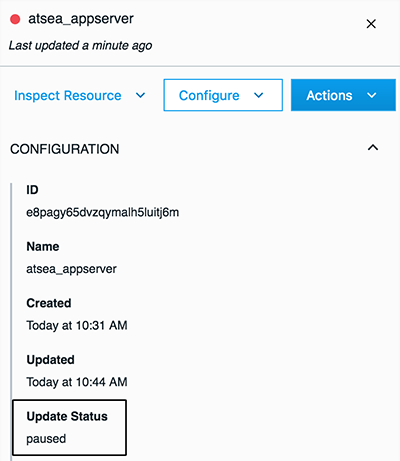

# Deploying Multi-OS applications with Docker EE

Docker EE 17.06 is the first Containers-as-a-Service platform to offer production-level support for the integrated management and security of Linux AND Windows Server Containers.

In this lab we'll use a Docker EE cluster comprised of Windows and Linux nodes. We'll deploy both a Linux and Windows web app, as well as a multi-service application that includes both Windows and Linux components. We will then look at scaling up your web app, as well how Docker EE handles system interruptions and upgrades.

This lab is built entirely on the capabilities and features of Microsoft Azure. Azure provides the infrastructure components necessary to build and maintain a production grade Docker Enterprise Edition cluster. We will be using multiple Azure Services throughout this lab.  

**Difficulty**: Intermediate (assumes basic familiarity with Docker)

**Time**: Approximately 75 minutes

**Tasks**:
* [Task 0: Setup the lab environment](#task0)
	* [Task 0.1: Sign up for a free 30-day Docker EE Trial License](#task0.1)
	* [Task 0.2: Deploy Docker EE cluster to Azure](#task0.2)
	* [Task 0.3: Connect to Azure Virtual Machines](#task0.3)
* [Task 1: Configure the Docker EE Cluster](#task1)
  * [Task 1.1: Accessing PWD](#task1.1)
  * [Task 1.2: Install a Windows worker node](#task1.2)
  * [Task 1.3: Create Two Repositories](#task1.3)
* [Task 2: Deploy a Linux Web App](#task2)
  * [Task 2.1: Clone the Demo Repo](#task2.1)
  * [Task 2.2: Build and Push the Linux Web App Image](#task2.2)
  * [Task 2.3: Deploy the Web App using UCP](#task2.3)
* [Task 3: Deploy a Windows Web App](#task3)
  * [Task 3.1: Create the Dockerfile with Image2Docker](#task3.1)
  * [Task 3.2: Build and Push Your Image to Docker Trusted Registry](#task3.2)
  * [Task 3.3: Deploy the Windows Web App](#task3.3)
* [Task 4: Deploy a Multi-OS Application](#task4)
  * [Task 4.1: Examine the Docker Compose File](#task4.1)
  * [Task 4.2: Deploy the Application Stack](#task4.2)
  * [Task 4.3: Verify the Running Application](#task4.3)
* [Task 5: Application Lifecycle Management](#task5)
  * [Task 5.1: Upgrading the Web Front-end](#task5.1)
  * [Task 5.2: Scaling the Web Front-end](#task5.2)
  * [Task 5.3: Dealing with an Application Failure](#task5.3)

## Document conventions

- When you encounter a phrase in between `<` and `>`  you are meant to substitute in a different value.

	For instance if you see `<dtr domain>` you would actually type something like `dtr-contoso.eastus.cloudapp.azure.com`

- When you see the Linux penguin all the following instructions should be completed in your Linux console

	

- When you see the Windows flag all the subsequent instructions should be completed in your Windows console

	

## <a name="task0"></a>Task 0: Setup the lab environment

Before we can dive into deploying containers, we need to provision a Docker EE environment. This involves signing up for a Docker EE Trial License and provisioning the required Azure Infrastructure.

### <a name="task 0.1"></a>Task 0.1: Sign up for a free 30-day Docker EE Trial License

Let's first register for a Docker ID account, which we will use to generate a trial license.

1. Navigate in your web browser to [the Docker Store](https://store.docker.com).

	

1. In the to pright corner, click `Log In`. On the Log In screen, select `Create Account` and complete the new account process.

1. Verify your email address by clicking the verification link in the email sent by Docker Store. 

1. Login into the Docker Store, navigate to [Docker Enterprise Edition Trial](https://store.docker.com/editions/enterprise/docker-ee-trial), and select `Start 1 Month Trial`. 

	

1. Complete the form and click `Start your evaluation`. You will be taken to the Setup Instructions screen. 

	Note that URL at the bottom of the `Resources` column; it is labeled "Copy and pase this URL to download your Edition" and is structured as `https://storebits.docker.com/ee/trial/sub-00000000-0000-0000-0000-000000000000`. This URL is your specific Docker EE Trial License Key and will be used when we provision Azure resources.

	Also under the `Resources` section, click `License Key` to download a `docker_subscription.lic` file. This file is uploaded to a running Docker EE cluster to satisfying licensing requirements.

### <a name="task 0.2"></a>Task 0.2: Deploy Docker EE cluster to Azure

An Azure Resource Manager (ARM) Template is provided for this lab. The template provisions all necessary cloud infrastructure to a new Azure Resource Group. 

1. Right-click the following blue `Deploy to Azure` button and open the hyperlink in a new browser tab or window:

	<a href="https://portal.azure.com/#create/Microsoft.Template/uri/https%3A%2F%2Fraw.githubusercontent.com%2Fstevenfollis%2Fhybrid-workshop%2Fmaster%2Farm_template%2Fazuredeploy.json" rel="nofollow">
			
	</a>

1. The Azure Portal will open in the new tab. Sign in, and on the Custom Deployment configure the template deployment:

	* Select the subscription that you would like to use for this lab from the dropdown box
	
	* Create a new Resource Group, named in a way that is decently unique (we use this name as part of URLs). Your initials, or a few random numbers are sufficient. ex. `sf-docker-lab`, `docker-ee-421`, or `lab413`.
	
	* In the `DockerEEURL` box, paste in the URL that you copied down from the Docker Store in the previous activity. This is the URL that looks like `https://storebits.docker.com/ee/trial/sub-00000000-0000-0000-0000-000000000000` and is used to automatically setup the cluster with your 30-Day Trial License.

	

1. With the form completed, check the box for `I agree to the terms and conditions stated above` and click the `Purchase` button to begin the provisioning process.

The provisioning process often takes 15-20 minutes to fully create and setup the entire Docker EE Cluster. In the interim, please feel free to take a short break, or begin watching the YouTube Video entitled [Getting Started with Docker for Windows and .NET Apps](https://www.youtube.com/watch?v=Pitm1x7pTfI).

1. When the template deployment is completed, navigate to your Azure Resource Group and on the left-hand side select `Deployments`. 
	
	

1. Select the single deployment named `Microsoft.Template`, and on the following blade select `Outputs`. Make note of the `UCP_URL` and `DTR_URL`, as we will use these hyperlinks in future steps.

	


### <a name="task 0.3"></a>Task 0.3: Connect to Azure Virtual Machines

One of the key benefits of Docker EE is the ability to manage both Linux-based and Windows-based applications side-by-side on a single cluster. In the lab will be accessing using both types of Azure Virtual Machines, so let's test connectivity ahead of time. 

1. In the Azure Resource Group blade where the resources were provisioned, select the Virtual Machine named `worker-win-02`. From the VM's blade, click `Connect` to download a Windows Remote Desktop Connection File (.rdp).  

	> **Note** When navigating in a Resource Group that container numerous resources, toggle the `No grouping` dropdown on the top-right control bar to `Group by type`. It will be infinitely easier to locate particular resources.

	On your local machine, open the .rdp file and login using username `\eeadmin` and password `DockerEE123!`. Open a PowerShell window inside of the RDP connection.

	> **Note** Remote Desktop is also available for Mac Users via the [Apple Store](https://itunes.apple.com/us/app/microsoft-remote-desktop-8-0/id715768417?mt=12)

1. Back in the Azure Resource Group blade, select the virtual machine named `worker-linux-02`. From the VM's blade, click `Connect` to see the command for starting an SSH connection to the node. Example `ssh eeadmin@13.92.152.49`

	On your local machine, SSH into the VM. If you are running Windows 10 Fall Creator's Update or later you have SSH built into PowerShell and can run the `ssh` command directly in PowerShell. Otherwise, [putty](https://www.howtogeek.com/311287/how-to-connect-to-an-ssh-server-from-windows-macos-or-linux/) can be used.

You have now accessed each type of VM used in today's lab.

## <a name="task1"></a>Task 1: Configure the Docker EE Cluster

The Docker EE Cluster is almost completely set up, but before we can begin the labs, we need to do two more steps. First we'll add an additional Windows node to the cluster, and then we'll create two repositories on the DTR server.

### <a name="task 1.1"></a>Task 1.1: Accessing UCP

The "Universal Control Plane" is a web-based interface for administering our container workloads across an entire cluster of virtual machine nodes. Next, we will use UCP to finalize our cluster configuration.

1. Navigate in your web browser to the UCP URL that you previously located in the Azure Portal. ex. `https://ucp-sf-docker-lab.eastus.cloudapp.azure.com`

	> **Note**: Because this is a lab-based install of Docker EE we are using the default self-signed certificates. Because of this your browser may display a security warning. It is safe to click through this warning.
	>
	> In a production environment you would use certificates from a trusted certificate authority and would not see this screen.
	> 

1. When prompted enter the username `admin` and password `DockerEE123!`. The UCP web interface should load up in your web browser.

### <a name="task1.2"></a>Task 1.2: Install a Windows worker node

Let's start by adding our 2nd Windows Server 2016 worker node to the cluster.

1. From the main dashboard in UCP, click `Add a Node` on the bottom left of the screen

	

1. Select node type "Windows", check the box, that you followed the instructions and copy the text from the dark box shown on the `Add Node` screen.

	> **Note** There is an icon in the upper right corner of the box that you can click to copy the text to your clipboard
	

	> **Note**: You may notice that there is a UI component to select `Linux` or `Windows`on the `Add Node` screen. In a production environment where you are starting from scratch there are [a few prerequisite steps] to adding a Windows node. However, we've already done these steps in the PWD environment. So for this lab, just leave the selection on `Linux` and move on to step 2


1. We need to run the `docker swarm join` command inside of a Window Server node to add it to the cluster. Open the Remote Desktop Connection to your `worker-win-02` Windows Server VM from earlier.

1. Paste the `docker swarm join` text from UCP into a command prompt or PowerShell window in the remote desktop connection.

	You should see the message `This node joined a swarm as a worker.` indicating you've successfully joined the node to the cluster.

1. Switch back to the UCP server in your web browser and click the `x` in the upper right corner to close the `Add Node` window

1. You should be taken to the `Nodes` screen and will see 3 nodes listed at the bottom of your screen.

	Initially the new worker node will be shown with status `down`. After a minute or two, refresh your web browser to ensure that your Windows worker node has come up as `healthy`

	

Congratulations on adding a Windows node to your UCP cluster. Next up we'll create a couple of repositories in Docker Trusted Registry.

### <a name="task1.3"></a>Task 1.3: Create Two DTR Repositories

Docker Trusted Registry is a special server designed to store and manage your Docker images. In this lab we're going several different Docker images, and push them to DTR. But before we can do that, we need to setup repositories in which those images will reside.

1. Open DTR from the URL located in the Ouputs section of the Azure Portal's Template Deployment blade that we located earlier

	> **Note**: As with UCP before, DTR is also using self-signed certs. It's safe to click through any browser warning you might encounter.

2. From the main DTR page click `New Repository`. This brings up the new repository dialog

	

3. Under `REPOSITORY NAME` type `linux_tweet_app`. Leave the rest of the values the same, and click `Save`

	Let's repeat this process to create a repository for our Windows tweet app.

4. Once again, click the green `New repository` button.

5. Under `REPOSITORY NAME` type `windows_tweet_app`. Leave the rest of the values the same, and click `Save`

	

Congratulations, you have created two new repositories.

## <a name="task2"></a>Task 2: Deploy a Linux Web App

Now that we've completely configured our cluster, let's deploy a couple of web apps. These are simple web pages that allow you to send a tweet. One is built on Linux using NGINX and the other is build on Windows Server 2016 using IIS.  

Let's start with the Linux version.

### <a name="task2.1"></a> Task 2.1: Clone the Demo Repo


1. SSH into the `worker-linux-02` VM that we tested earlier.

1. Use git to clone the workshop repository.

	```
	$ git clone https://github.com/stevenfollis/hybrid-workshop.git
	```

	You should see something like this as the output:

	```
	Cloning into 'hybrid-workshop'...
	remote: Counting objects: 13, done.
	remote: Compressing objects: 100% (10/10), done.
	remote: Total 13 (delta 1), reused 10 (delta 1), pack-reused 0
	Unpacking objects: 100% (13/13), done.
	Checking connectivity... done.
	```

	You now have the necessary demo code on your worker host.

### <a name="task2.2"></a> Task 2.2: Build and Push the Linux Web App Image


1. Change into the `linux_tweet_app` directory.

	`$ cd ./hybrid-workshop/linux_tweet_app/`

1. Use `docker build` to build your Linux tweet web app Docker image.

	`$ docker build -t <dtr hostname>/<your user name>/linux_tweet_app .`

	> **Note**: Be sure to substitute your DTR Hostname and your User Name - both these are listed at the top of your PWD page.

	The `-t` tags the image with a name. In our case, the name indicates which DTR server and under which user's respository the image will live.

	> **Note**: Feel free to examine the Dockerfile in this directory if you'd like to see how the image is being built.

	Your output should be similar to what is shown below

		Sending build context to Docker daemon  4.096kB
		Step 1/4 : FROM nginx:latest
		latest: Pulling from library/nginx
		ff3d52d8f55f: Pull complete
		b05436c68d6a: Pull complete
		961dd3f5d836: Pull complete
		Digest: sha256:12d30ce421ad530494d588f87b2328ddc3cae666e77ea1ae5ac3a6661e52cde6
		Status: Downloaded newer image for nginx:latest
		---> 3448f27c273f
		Step 2/4 : COPY index.html /usr/share/nginx/html
		---> 72d22997a765
		Removing intermediate container e262b9220942
		Step 3/4 : EXPOSE 80 443
		---> Running in 54e4ff1b39a6
		---> 2b5bd87894cd
		Removing intermediate container 54e4ff1b39a6
		Step 4/4 : CMD nginx -g daemon off;
		---> Running in 54020cdec942
		---> ed5f550fc339
		Removing intermediate container 54020cdec942
		Successfully built ed5f550fc339
		Successfully tagged  <dtr hostname>/<your user name>/linux_tweet_app:latest

1. Log into your DTR server from the command line

	```
	$ docker login <dtr hostname>
	Username: <your username>
	Password: <your password>
	Login Succeeded
	```
1. Use `docker push` to upload your image up to Docker Trusted Registry.

	```
	$ docker push <dtr hostname>/<your user name>/linux_tweet_app
	```

	The output should be similar to the following:

	```
	The push refers to a repository [<dtr hostname>/<your user name>/linux_tweet_app]
	feecabd76a78: Pushed
	3c749ee6d1f5: Pushed
	af5bd3938f60: Pushed
	29f11c413898: Pushed
	eb78099fbf7f: Pushed
	latest: digest: sha256:9a376fd268d24007dd35bedc709b688f373f4e07af8b44dba5f1f009a7d70067 size: 1363
	```

1. In your web browser head back to your DTR server and click `View Details` next to your `linux_tweet_app` repo to see the details of the repo.

	> **Note**: If you've closed the tab with your DTR server, just click the `DTR` button from the PWD page.

1. Click on `Images` from the horizontal menu. Notice that your newly pushed image is now on your DTR.

### <a name="task2.3"></a> Task 2.3: Deploy the Web App using UCP

Now let's run our application by creating a new service.

Services are application building blocks (although in many cases an application will only have one service, such as this example). Services are based on a single Docker image. When you create a new service you instantiate at least one container automatically, but you can scale the number up (or down) to meet the needs of your service.

1. Switch back to your UCP server in your web broswer

	> **Note**: If you've closed your UCP tab, you can simply click `UCP` from the PWD page to relaunch the UCP web interface

1. In the left hand menu click `Services`

1. In the upper right corner click `Create Service`

1. Enter `linux_tweet_app` for the name.

1. Under `Image` enter the path to your image which should be `<dtr hostname>/<your user name>/linux_tweet_app`

1. From the left hand menu click `Network`

1. Click `Publish Port+`

	We need to open a port for our web server. Since port 80 is already used by UCP on one node, and DTR on the other, we'll need to pick an alternate port. We'll go with 8088.

1. Fill out the port fields as shown below

	

1. Click `Confirm`

1. Click `Create` near the bottom right of the screen.

After a few seconds you should see a green dot next to your service name. Once you see the green dot you can point your web browser to `http://<UCP hostname>:8088` to see your running website  (it may take a minute or so after the dot turns green for the service to be fully available).

> **Note**: You want to go to `http://` not `https://`

You may also click on the service to open the right sidebar to inspect the service and click on the link under `published endpoints` in the configuration section.

### Extra Credit: Ingress Load Balancing

1. In UCP click on `Services` in the left hand menu.

1. From the List of services click on `linux_tweet_app`

1. From the dropdown on the right-hand side select `Inspect Resources` and then `Containers` Notice which host the container is running on. Is it running on the manager or the worker node?

	

	If it's the worker node, how did your web browser find it when we pointed at the UCP Manager node?

1. Point your browser at `http://<DTR hostname>:8088`. Did the site come up?

	In the end it doesn't matter if we try and access the service via the manager or the worker, Docker EE will route the request correctly.

	> **Note**: DTR is running on the worker node, so pointing to the DTR server is the same as pointing at the worker node.

	This is an example of the built in ingress load balancer in Docker EE. Regardless of where a Linux-based service is actually running, you can access it from any Linux node in the cluster. So, if it's running on the manager in our cluster, you can still get to it by accessing the worker node. Docker EE can accept the request coming into any of the Linux nodes in the cluster, and route it to a host that's actually running a container for that service.

1. Be sure to clear the filter in the UCP UI by clicking the `X` in the upper right corner. If you don't do this, you won't see any of the other services you deploy later in the lab

	

## <a name="task3"></a>Task 3: Deploy a Windows Web App

Now we'll deploy the Windows version of the tweet app.

### <a name="task3.1"></a> Task 3.1: Create the dockerfile with Image2Docker

There is a Windows Server 2016 VHD that contains our Windows Tweet App stored in `c:\` on Windows host. We're going to use Image2Docker to scan the VHD, and create a Dockerfile. We'll build the Dockerfile as we did in the previous step, push it to DTR, and then deploy our Windows tweet app.


1. Click the name of your Windows host in PWD to switch your web console.

1. Set up the Image2Docker PowerShell module - you need to install the module, and then import it to make it available in the session. Copy and paste these commands into the Windows console:

```
Install-Module -Force Image2Docker
```

```
Import-Module Image2Docker
```

1. Use Image2Docker's `ConvertTo-Dockerfile` command to create a dockerfile from the VHD.

	Copy and paste the command below into your Windows console window.

	```
	ConvertTo-Dockerfile -ImagePath c:\ws2016.vhd -Artifact IIS -OutputPath C:\windowstweetapp -Verbose
	```

	As mentioned before Image2Docker will scan the VHD, and extract out a Dockerfile based on the contents of the VHD. The list below explains the command line arguments.

	* `ImagePath` specifies where the VHD can be found

	* `Artifact` specifies what feature or code to look for

	* `OutputPath` specifies where to write the dockerfile and other items

	* `Verbose` instructs the script to provide extra output.

When the process completes you'll find a Dockerfile in `c:\windowstweetapp`


### <a name="task3.2"></a> Task 3.2: Build and Push Your Image to Docker Trusted Registry


1. CD into the `c:\windowstweetapp` directory (this is where your Image2Docker files have been placed).

	`PS C:\> cd c:\windowstweetapp\`


1. Use `docker build` to build your Windows tweet web app Docker image.

	`$ docker build -t <dtr hostname>/<your user name>/windows_tweet_app .`

	> **Note**: Feel free to examine the Dockerfile in this directory if you'd like to see how the image is being built.

	Your output should be similar to what is shown below

	```
	PS C:\windowstweetapp> docker build -t <dtr hostname>/<your user name>/windows_tweet_app .

	Sending build context to Docker daemon  415.7kB
	Step 1/8 : FROM microsoft/iis:windowsservercore-10.0.14393.1715
	 ---> 590c0c2590e4

	<output snipped>

	Removing intermediate container ab4dfee81c7e
	Successfully built d74eead7f408
	Successfully tagged <dtr hostname>/<your user name>/windows_tweet_app:latest
	```
	> **Note**: It will take a few minutes for your image to build.

1. Log into Docker Trusted Registry

	```
	PS C:\> docker login <dtr hostname>
	Username: <your username>
	Password: <your password>
	Login Succeeded
	```

1. Push your new image up to Docker Trusted Registry.

	```
	PS C:\Users\docker> docker push <dtr hostname>/<your username>/windows_tweet_app
	The push refers to a repository [<dtr hostname>/<your username>/windows_tweet_app]
	5d08bc106d91: Pushed
	74b0331584ac: Pushed
	e95704c2f7ac: Pushed
	669bd07a2ae7: Pushed
	d9e5b60d8a47: Pushed
	8981bfcdaa9c: Pushed
	25bdce4d7407: Pushed
	df83d4285da0: Pushed
	853ea7cd76fb: Pushed
	55cc5c7b4783: Skipped foreign layer
	f358be10862c: Skipped foreign layer
	latest: digest: sha256:e28b556b138e3d407d75122611710d5f53f3df2d2ad4a134dcf7782eb381fa3f size: 2825
	```
1. You may check your repositories in the DTR web interface to see the newly pushed image.

### <a name="task3.3"></a> Task 3.3: Deploy the Windows Web App

Now that we have our Windows Tweet App up on the DTR server, let's deploy it. It's going to be almost identical to how did the Linux version with a couple of one small exceptionn: Docker EE on Windows Server 2016 does not currently support ingress load balancing, so we'll expose the ports in `host` mode using `dnsrr`

1. Switch back to UCP in your web browser

1. In the left hand menu click `Services`

1. In the upper right corner click `Create Service`

1. Enter `windows_tweet_app` for the name.

1. Under `Image` enter the path to your image which should be `<dtr hostname>/<your username>/windows_tweet_app`

1. From the left hand menu click `Network`

1. Set the `ENDPOINT SPEC` to `DNS Round Robin`. This tells the service to load balance using DNS. The alternative is VIP, which uses IPVS.

1. Click `Publish Port+`

	We need to open a port for our web server. This app runs on port 80 which is used by DTR so let's use 8082.

1. Fill out the port fields as shown below. **Be sure to set the `Publish Mode` to  `Host`**

	

1. Click 'Confirm'

1. Click `Create` near the bottom right of the screen.

After a few seconds you should see a green dot next to your service name. Once you see the green dot you can point your web browser to `http://<windows host>:8082` to see your running website.

## <a name="task4"></a> Task4: Deploying a Multi-OS Application

For our last exercise we'll use a docker compose file to deploy an application that uses a Java front end designed to be deployed on Linux, with a Microsoft SQL Server back end running on windows.

### <a name="task4.1"></a> Task 4.1: Examine the Docker Compose file

We'll use a Docker Compose file to instantiate our application. With this file we can define all our services and their parameters, as well as other Docker primitives such as networks.

Let's look at the Docker Compose file:

```
version: "3.2"

services:

  database:
    image: sixeyed/atsea-db:mssql
    ports:
      - mode: host
        target: 1433
    networks:
     - atsea
    deploy:
      endpoint_mode: dnsrr

  appserver:
    image: mikegcoleman/atsea_appserver:1.0
    ports:
      - target: 8080
        published: 8080
    networks:
      - atsea

networks:
  atsea:
```

There are two services. `appserver` is our web frontend written in Java, and `database` is our Microsoft SQL Server database. The rest of the commands should look familiar as they are very close to what we used when we deployed our tweet services manually.

One thing that is new is the creation of an overlay network (`atsea`). Overlay networks allow containers running on different hosts to communicate over a private software-defined network. In this case, the web frontend on our Linux host will use the `atsea` network to communicate with the database.

### <a name="task4.2"></a> Taks 4.2 Deploy the Application Stack

A `stack` is a group of related services that make up an application. Stacks are a newer Docker primitive, and can be deployed with a Docker Compose file.

Let's Deploy an application stack using the Docker Compose file above.

1. Move to the UCP console in your web browser

1. In the left hand menu click `Stacks`

1. In the upper right click `Create Stack`

1. Enter `atsea` under `NAME`

1. Select `Services` under `MODE`

1. Select `SHOW VERBOSE COMPOSE OUTPUT`

1. Paste the compose file from above into the `COMPOSE.YML` box

1.  Click `Create`

	You will see some output to show the progress of your deployment, and then a banner will pop up at the bottom indicating your deployment was successful.

1. Click `Done`

You should now be back on the Stacks screen.

1. Click on the `atsea` stack in the list

1. From the right side of the screen choose `Services` under `Inspect Resource`

	

	Here you can see your two services running. It may take a few minutes for the database service to come up (the dot to turn green). Once it does, move on to the next section.


### <a name="task4.3"></a> Task 4.3: Verify the Running Application

1. To see our running web site (an art store) visit `http://<UCP hostname>:8080>` or click on the published endpoint link under "Configuration" in the sidebar

	The thumbnails you see displayed are actually pulled from the SQL database. This is how you know that the connection is working between the database and web front end.

## <a name="task5"></a> Task 5: Application Lifecycle Management

Now that we've deployed our application, let's take a look at some common tasks that admins need to do to keep their apps running and up-to-date. We'll start by upgrading the web front end, next we'll scale that service to meet demand, and then finally we'll see how to deal with the failure of a node in our UCP cluster.

### <a name="task5.1"></a> Task 5.1: Upgrading the Web Front-end

In this section we're going to first simulate a failed upgrade attempt, and see how to deal with that. The way we upgrade a running service is to update the image that service is based on. In this case the image we're going to upgrade to is broken. So when it's deployed UCP will pause the upgrade process, from there we can roll the application back to it's previous state.

1. Move back into Universal Control Plane

2. If your services are not currently displayed, click on `Services` from the left hand menu

3. Click on the `atsea_appserver` service from the list

4. On the left, under `Configure` select `Details`

	

5. Under image, change the value to `mikegcoleman/atsea_appserver:2.0`

6. Click `Update` in the bottom right corner

7. Click on the `atsea_appserver` service from the list

8. The service indicator will turn from green to red, and if you look at the details on the right you'll see the `Update Status` go from `Updating` to `Paused`

	This is because the container that backs up the service failed to start up.

	

9. From the right hand side click `Containers` under `Inspect Resource` and you will see the containers have all exited with an error.

	Also notice under image that these containers are running the `2.0` version of our application

10. Click `Services` from the left hand menu.

11. Click the `atsea_appserver` service from the list.

12. Under `Actions` on the right hand side click `Rollback`

	This will tell UCP to restore the service to its previous state. In this case, running the 1.0 version of our webserver image

	After a few seconds the indicator should go from red to green, when it does move on to the next step.

13. Click the `atsea_appserver` service from the list.

14. From the right hand side click `Containers` under `Inspect Resource` and you will see the container has started and is healthy.

	Also notice under image that the container is running the `1.0` version of our application.

15. In your web browser navigate to `<http://<ucp hostname>:8080>` and verify that your website is still running

Now that we've dealt with a failed upgrade, let's look at rolling out a successful upgrade

1. Move back to UCP in your web browser

1. Move back into Universal Control Plane

2. If your services are not currently displayed, click on `Services` from the left hand menu

3. Click on the `atsea_appserver` service from the list

4. On the left, under `Configure` select `Details`

	

5. Under image, change the value to `mikegcoleman/atsea_appserver:3.0`

6. Click `Update` in the bottom right corner

7. Click on the `atsea_appserver` service from the list

8. Notice the `Update Status` reads updating, and the indicator in the main area will go from green to red to green.

9.  From the right hand side click `Containers` under `Inspect Resource` and you will see the container has started and is healthy.

	Also notice under image that the container is running the `3.0` version of our application.

10. In your web browser navigate to `<http://<ucp hostname>:8080>` to see the new version of the website (if you already have the site up and running, simply refresh your browser)


### <a name="task5.2"></a> Task 5.2: Scaling the Web Front-end

The new site design appears to have dramatically increased the popularity of your website. In order to deal with increased demand, you're going to need to scale up the number of containers in the `atsea_appserver` service.

1. Move to UCP in your web browser

2. From the left hand menu click `Services`

3. Click the `atsea_appserver` service

4. From the `Configure` drop down on the right choose `Scheduling`

5. Change `Scale` from `1` to `4`

6. Click `Update`

7. The indicator changes to yellow to indicate the service is still running, but undergoing an update. You also notice it reads `1/4` - this tells you that you have one healthy container out of the four you require. Regardless, your website is still available at this point.

	After a minute or so you'll see the indicator turn green, and you will see the status go to `4/4`

8. Click the `atsea_appserver` from the list

9. From the right hand side click `Containers` under `Inspect Resource` and you will see the four containers have started and are healthy.

	Also notice under `Node` that some containers are running on `worker1` and some are running on `manager1`

10. Go to your website in your brower and refresh the page, you will notice in the upper right the IP and Host change. This output is the IP and container ID of the actual container that served up the web page.

	> **Note**: If you are not running in an incognito window you may need to force your browser to ignore the cache in order to see the values change. Consult the help section of your browser to learn how to do this.

Everything seems to be humming along nicely until one of your nodes in the cluster fails. In the next section we'll show how Docker EE deals with these sort of failuers.

### <a name="task5.3"></a> Task 5.3: Dealing with an Application Failure

Docker EE will always try and reconcile your services to their desired state. For instance, in the case of our web frontend, we have specified we want four containers running. If for some reason the number ever drops below four, Docker EE will attempt to get the service back to four containers.

In this section we're going to simulate a node failure and see how Docker EE handles the situation. We're not actually going to crash a node. What we're going to do is put our worker node in `Drain` mode - which is essentially maintenance mode. We are telling Docker EE to shut all the containers that are running on that node down, and not schedule any additional work on to that node.

1. Move to UCP in your web browser

2. If the filter bar is active (the blue bar at the top of the screen) - click the `x` in the upper right corner to clear the filter.

3. From the left menu click `Nodes`

4. Click on `worker1`

5. From the `Configure` dropdown on the right side select `Details`

6. Under `Availability` click `Drain`

7. Click `Save`

	This will immediately put the `worker1` node into Drain mode, and stop all running containers on that node.

8. Go to the AtSea website and refresh to verify it's still running.

	Even though one node failed, the built in Docker EE load balancer will direct traffic to the containers running on our healthy `manager1` node

9. Move back to UCP

10. Click the `x` in the upper right corner to close the `Edit Node` screen

	Notice that `worker1` still has a green indicator, this is because technically the node is still running and healthy. However, on the right hand side you'll see the `Availability` listed as `DRAIN`

11. Click on `Services` from the left hand menu

12. Click on the `atsea_appserver`

13. From the `Inspect Resource` drop down on the right select `Containers`

	Notice that the two containers that were running on `worker1` have been stopped, and they have been restarted on `manager1`


## Conclusion

In this lab we've looked how Docker EE can help you manage both Linux and Windows workloads whether they be traditional apps you've modernized or newer cloud-native apps. We also looked at how to deal with upgrades, scaling, and system failures.

You can find more information on Docker EE at [http://www.docker.com](http://www.docker.com/enterprise-edition) as well as continue exploring using our hosted trial at [https://dockertrial.com](https://dockertrial.com)
